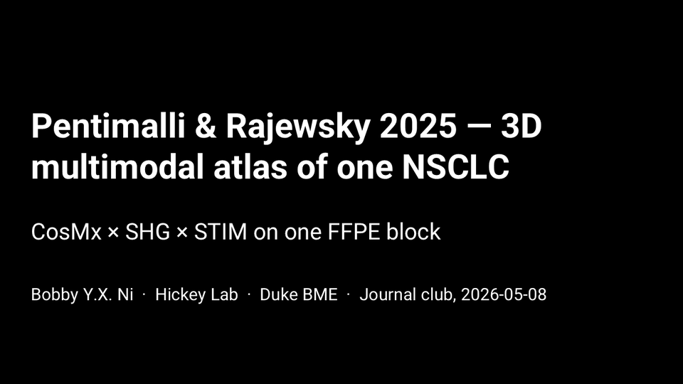
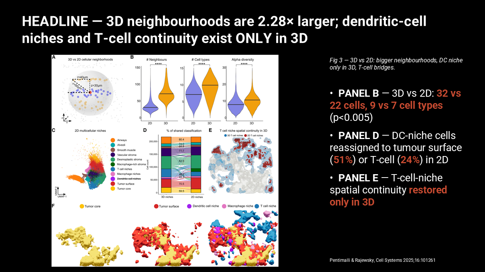
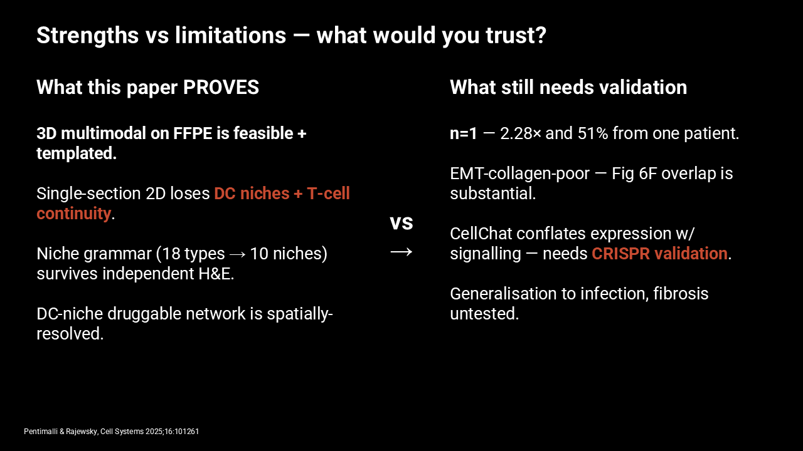

<h1 align="center">VaultLab</h1>

<p align="center">
  <b>The Claude Code setup for biological research.</b><br>
  Centralized lab memory + literature + data analysis + figures + manuscripts + slides — directed by you, run by Claude Code.
</p>

<p align="center">
  <a href="https://pypi.org/project/vaultlab/"></a>
  <a href="https://pypi.org/project/vaultlab/"></a>
  <a href="LICENSE"></a>
  <a href="https://github.com/bobbyni819/vaultlab/actions"></a>
  <a href="docs/KNOWN_LIMITATIONS.md"></a>
</p>

> *"Most lit-search tools answer one question. VaultLab is what happens when your literature, your wet-lab data, your meeting transcripts, your inbox, and your manuscript live in one place that an LLM can read."*

## Quickstart — paste this into Claude Code

Open Claude Code anywhere on your machine and paste:

```
Hi Claude. Set me up to use vaultlab — github.com/bobbyni819/vaultlab.
Bootstrap end-to-end (each step idempotent — skip if already done):

1. Check `python -c "import vaultlab"`. If missing, run
   `pip install vaultlab` (v0.0.5+ is on PyPI). For development /
   editable install, clone to ~/code/vaultlab and `pip install -e .[all]`.
2. Run `vaultlab init` (accept default ~/vaultlab-kb if prompted).
3. Run `vaultlab claude-setup` to wire slash commands + global CLAUDE.md.
4. Read vaultlab/READ_FIRST.md and absorb the dispatch table.
5. Ask me what project I want to set up. When I describe it, run
   /onboard-me to drive the natural-language intake.

Summarize what's installed, then wait for my project description.
```

Claude does the entire bootstrap — clone → pip install → KB init → slash command wiring → reads the dispatch table → asks what project you want. After step 5, slash commands like `/lit-arc`, `/build-deck`, `/cite audit` are available in every Claude Code session on your machine. Full walkthrough: [`QUICKSTART.md`](QUICKSTART.md).

## First run — produce a real artifact in under 5 minutes

No KB, no API key, no Claude Code required to confirm the install works:

```bash
pip install vaultlab
vaultlab demo
```

This composes a real audit-clean journal-club deck from a bundled
open-access paper and two synthetic figures, **fully offline**. You get
the same output shape every other vaultlab pipeline produces:

```
./vaultlab-demo-out/
  deck.pptx                       # 7-slide journal-club deck
  deck.pptx.provenance.json       # machine-readable receipt (inputs, params, hashes)
  deck.pptx.method.md             # human-readable methods narrative
  inputs/
    paper.json                    # the seed metadata — edit + re-run to remix
    figures/                      # the synthetic PNGs the deck uses
```

Runs in ~1-2 seconds. No network calls, no LLM invocations — useful as a
smoke test in CI or on a fresh machine before you trust the heavier
slash-command workflows. Customize: edit `inputs/paper.json` (or pass
`--out-dir <other>`) and re-run.

### Reproduce the onboarding test

The 30-min time-to-first-artifact bar is verified in CI on every push
via [`.github/workflows/onboarding.yml`](.github/workflows/onboarding.yml) —
a clean Python 3.13 Docker container runs `pip install` from the working
tree, then `vaultlab demo`, and asserts the elapsed wall-clock is under
the bar. To reproduce locally:

```bash
docker build -f Dockerfile.onboarding -t vaultlab-onboarding .
docker run --rm vaultlab-onboarding
```

A green run of the **Onboarding (Time-to-First-Artifact)** workflow is
the published evidence that north-star Criterion #4 (under-30-min cold
start to first artifact) is met on each commit to `main`.

## What's new in v0.0.5 (2026-05-15)

19 of 20 north-star plan sub-goals shipped in one session. Highlights:

- **All 4 red lines now mechanically enforced** by an always-on CI invariant suite (no fabrication / no silent failures / no user-data loss / no vendor lock-in). 8/0 passing.
- **`vaultlab demo`** — single command produces an audit-clean journal-club deck in ~1.1s. Fully offline. (`pip install vaultlab && vaultlab demo`)
- **All 7 nature-skills absorbed.** `vaultlab.research.full_reader` is the final piece — bilingual figure-aware full-paper Markdown reader.
- **6 new SPEC executions:** result-analysis pipeline, KB retrieval upgrade, KB setup/lint primitives, crosstalk policy, task-weight dispatch, meta-agent roles.
- **HTML coverage:** 12 of Thariq's 20 patterns now ship with real consumers. New: weekly status, state dashboard, feature flag editor, three-approaches comparison.
- **Slide templates + layouts:** 4 deck templates (investor_pitch, lab_meeting, conference_talk, journal_club) + 4 new layouts (equation, table, comparison_table, acknowledgments_grid).
- **GitHub Discussions LIVE** — testimony channel at [github.com/bobbyni819/vaultlab/discussions](https://github.com/bobbyni819/vaultlab/discussions). Tell us if you used vaultlab for something.

Full release notes: [CHANGELOG.md](CHANGELOG.md).

## About

I'm Bobby Ni, a PhD student in Biomedical Engineering in the Hickey Lab at Duke University. I'm doing wet-lab, spatial omics work and building computational tools to create virtual tissue simulations.

Biomedical research at scale is fragmented: a lot of meetings, most of which don't get recorded; papers and notes piling up in Box; data on a lab NAS; archives on OneDrive; updates from collaborators from five different email chains. The university hands you several storage locations; the lab adds its own. Context lives everywhere - and VaultLab can organize all of it. 

VaultLab also handles massive literature paper fetching and review and draws on principles from frontier, LLM-powered scientific research frameworks to creates figures and write code and manuscript drafts.

All of it lives in an Obsidian knowledge base that Claude Code reads. The KB is plain markdown — runs on whatever storage you already have. VaultLab amplifies your research capabilities and does exactly what you want and beyond.


I've used OpenClaw and other agent harnesses to automate workflows. I've found more value operating inside Claude Code as a hands-on, human element is much needed in biomedical research. The push to ship this came from watching what [Garry Tan](https://github.com/garrytan/gstack), [Andrej Karpathy](https://gist.github.com/karpathy/442a6bf555914893e9891c11519de94f), [James Zou](https://github.com/zou-group/virtual-lab), and others have built — open-source, opinionated, hackable. Most of what's here adapts beyond research; the KB, citation auditing, and slide composition work on any topic.

---

**VaultLab lives inside [Claude Code](https://claude.com/claude-code).** Open Claude Code in a folder. VaultLab adds ~30 slash commands (`/lit-arc`, `/build-deck`, `/cite audit`, `/onboard-project`, `/lit-report`) that Claude Code reads as plain markdown. No Anthropic API key needed — Claude Code provides the LLM. KB is plain markdown on Google Drive, OneDrive, a lab NAS, or any folder that syncs. **If you've used Claude Code, you already know how to use VaultLab.**

---

## Centralized memory — one LLM session sees everything

VaultLab gives Claude Code a research-shaped working memory. The LLM doesn't just read code — it reads your literature, your meetings, your inbox + calendar, your knowledge base, your project state, all under one session. Cross-project observations surface automatically: *"You saw a similar exhausted-T-cell phenotype in your 2026-03 tonsil run."* Onboarding a new lab member is sharing the Drive folder.

| Context source | What VaultLab does with it |
|---|---|
| **Knowledge base** | Obsidian-native markdown that **grows with your work**. Per-paper Tier-A summaries with `[pN]` page-marker citations, citation graphs, lineage arcs, project pages, manuscript drafts — all linked by `[[wikilinks]]`. Plain markdown means it lives on Google Drive, OneDrive, a lab NAS, or any folder that syncs. No vector DB, no hidden state, no proprietary format. Onboarding: share the Drive folder. |
| **Literature** | Seven literature APIs orchestrated in parallel — NCBI/PubMed, CrossRef, Semantic Scholar, Springer Nature, Elsevier, bioRxiv, and the **paperclip-MCP 8M-paper biomedical corpus**. Cross-source dedup. Citation-graph ranking. *Content-aware picker reads up to 400 abstracts in one batched LLM call* before ranking — never lets a deceptive citation count outrank a topical paper. Full-text Tier-A reading on the picks. See [Literature search](#literature-search-across-seven-apis-in-parallel) below for depth. |
| **Built-in meeting recorder + transcriber** | Captures any meeting on your machine — Zoom, Teams, in-person — and transcribes **locally** (Whisper) or via cloud. Auto-summarized into the KB. Ask *"what did we decide about cluster 7 last Tuesday?"* and the answer comes from the transcript. Works whether or not you remembered to schedule it. |
| **Outlook (Windows) + entire Google Workspace** | Full Outlook COM integration — read inbox, send with signature preserved, reply to threads, manage drafts, search across folders, mass email with personalization, flagged-email management, calendar events, contacts, tasks. **Entire Google Workspace** via Google APIs — Gmail, Drive, Docs, Sheets, Calendar. Lab work-log entries auto-append to a shared Google Doc. *"Brief me on this morning"* assembles your day's calendar + unread emails + open tasks + recent work-log entries in one view. |
| **Cross-project state** | Every project has a `START_HERE.md` VaultLab maintains. Read one file and you're caught up in 30 seconds — what you were working on, what's blocking you, what to do next. Cross-project intelligence surfaces automatically when you start a new analysis. The KB IS the smartness layer; cross-project reasoning emerges via wikilinks + Tier-A summaries. |

---

## Features

### Literature search across seven APIs in parallel

**The conceptual workflow.** A vaultlab literature search casts a wide net, narrows it through a citation graph, **reads hundreds of abstracts in a single LLM call** to override the graph where it's wrong, then **reads 8 to 50+ full PDFs end-to-end** depending on scope. Every claim ends up traceable to a specific page of a specific paper.

Concretely, in order:

1. **Cast: 7 sources in parallel.** Every query fans out to **NCBI/PubMed, CrossRef, Semantic Scholar, Springer Nature, Elsevier, bioRxiv, and the [paperclip](https://paperclip.gxl.ai) 8M-paper biomedical corpus**. Each query is reformulated into **5 sub-queries** (original + method-focused + disease-focused + model-organism-focused + mechanism-focused). Results dedupe across all 7 sources by DOI + fuzzy title match.

2. **Coarse rank: the citation graph.** **OG-score** (Kessler bibliographic coupling — fraction of seed papers citing each candidate) and **forward-influence** (in-degree on the seed-x-seed subgraph) shrink the corpus to a manageable pool. The graph is the first filter, not the last.

3. **Override the graph by reading abstracts.** vaultlab reads **all 200–400 abstracts from the coarse pool in a single batched LLM call**, leveraging Claude's 1M-token context. The picker overrides the citation graph where conceptual lineage and citation count disagree — *a 2018 method paper that defined a field outranks a 2024 incremental application with 50× the citations.* Each pick's rationale is written to the project's decisions log.

4. **Deep-read the picks.** For the top selections — **default 8–10 papers for a standard `/lit-arc`, scaling to 50+ for thorough scope and 100+ for review-paper scope** — vaultlab fetches the full PDF (Unpaywall → PubMed Central → bioRxiv → Springer OA → Elsevier waterfall), then reads each via Claude as a `document` content block. Output: structured JSON per paper with `tldr` / `why_it_matters` / `methods_summary` / `key_findings`, each with `[pN]` page-marker citations.

5. **Assemble + persist.** Papers get binned by conceptual lineage (history → development → SOTA), the corpus assembles into a lineage arc with `[[wikilinks]]` between summaries, and **the whole thing is yours to keep** as plain markdown in `Wiki/Summaries/` + `Wiki/Concepts/`. The KB grows with every search; future runs build on past corpus instead of restarting.

**Why this matters in practice.** PaperQA stops at literature retrieval. Tools that only do citation-graph ranking get fooled by high-cite incremental papers and miss foundational ones. Skim-tier readers don't surface the methods nuance you need. vaultlab does all three layers — graph, semantic, deep-read — and gives you per-page traceability for every claim downstream.

The entry points are `/lit-arc <topic>` (corpus + arc + summaries) and `/lit-report <topic>` (formal report with sections). They share the same pipeline; the difference is the output format.

<details>
<summary><b>More: user-directable picks, batched-PDF reading, paywall handling, lineage binning</b></summary>

**User-directable.** You can pin specific DOIs as must-include (*"don't return without reading these three papers"*), focus on a particular lab (*"over-weight anything from the Schurch group"*), restrict by year/journal/open-access status, or specify a topical seed paper to anchor the corpus around. The picker respects the constraint and explains why each pick fits.

**Batched-PDF reading** (≥2 PDFs, ≤100 MB total) ships multiple full PDFs in one LLM call, leveraging the 1M-context window for cross-paper synthesis — comparing methods sections across three papers in a single call instead of three sequential reads.

**LLM-driven lineage binning.** Every paper gets binned by conceptual lineage, not just publication year. A 2018 method paper goes in *history* if it's foundational. A 2024 incremental application goes in *development*, not *sota*. The LLM gets the deterministic year-quartile assignment as a hint, then overrides it where conceptual lineage and chronology disagree. Solves the empty-history-bin failure that pure-quartile binning produces.

**Surfaces papers you can't auto-acquire.** When a high-priority paper is paywalled and OA-fallback fails, vaultlab surfaces it via `vaultlab fetch-list paywalled` — a shopping list with citation, DOI, and a one-line "why this matters." You don't lose track of the gap.

</details>

### Slide decks that compose themselves around your figures

`/build-deck <source>` composes a deck from whatever you point it at — a paper PDF, your wet-lab data, a manuscript draft, just a topic. VaultLab interrogates the source, picks the figures, drafts the speaker notes, audits the layout, and exports a native PowerPoint file (animatable shapes, editable post-export — never rasterized images).

**The figure-understanding step is real.** For paper figures, VaultLab reads them two ways: (1) the *sequence* — fig 1 is almost always experimental design, fig 2–3 are typically core results, fig N is the model — and (2) the *pixels* — content-density segmentation, panel detection via recursive XY-cut on whitespace gaps, single-panel cropping when only panel A is needed, white-margin auto-trim for tighter layouts. Multi-panel figures stay multi-panel; sparse schematics get the full slide width.

**Each figure slide picks its own layout** based on aspect ratio + content density + bullet count. Square multi-panel → side-caption (figure dominates 62% of slide width × full height; caption + bullets + citation in right gutter). Landscape banner → top-caption-with-bottom-right-caption (figure stretches across full slide width on top; bullets bottom-left, caption bottom-right). Pure schematics with no bullets → hero figure-only slide. The dispatcher picks; you don't write per-slide layout code.

**Speaker notes come in three tiers** so the same deck supports cold-reading the paper *and* rehearsing a 25-minute talk:

- `mental_map` — 5-line scannable keywords for the fluent presenter
- `script` — ~280 words of the say-this-out-loud monologue
- `extended_walkthrough` — ~750 words of background, jargon definitions, and "why this matters" for someone presenting cold

**Animations are click-by-click.** Bullets reveal one at a time; analogy-style strengths-vs-limitations slides reveal each side on its own click; multi-figure panels build up. Click-through rehearsal works in PowerPoint and Keynote without any cleanup.

**Inline emphasis is automatic.** ALL-CAPS labels are bolded; punchy result numbers and drug-target names get an accent color; take-aways pop. You write `**SAMPLE**` and `[c]340 644 cells[/c]` in your bullets and they render as bold + accent-color runs.

**Audit pass before you open the deck.** Every build runs a layout audit — overflow / overlap / off-slide / contrast / long-title / long-caption / over-bulleted / figure-gap / thin-text. Severity = `fail` blocks delivery. Companion sidecars are written alongside the .pptx: `argument-graph.md` (slide-by-slide claim chain), `practice-script.md`, `flashcards.md`, `story-arc.md`.

**It actively interacts with you.** When a paper is paywalled and OA fallback fails, the deck builder asks you to fetch the PDF manually before continuing — it tells you exactly which DOIs and why they matter to the deck. When a figure aspect doesn't match any default layout, it surfaces the choice. When the audit detects a layout regression, it reports per-slide which bullet overflowed by how many lines.

Use it for journal clubs, lab meetings, conference talks, prelim/qual exams, dissertation defenses. The pipeline is the same; the templates differ.

#### See it in action — last week's output



A 16-slide journal-club deck for **Pentimalli & Rajewsky 2025** in *Cell Systems* (3D NSCLC atlas via CosMx + SHG ECM imaging). VaultLab pulled all 7 figures from the paper PDF, auto-picked layouts (side-caption for the 6 square multi-panels, top-caption-br for the one landscape figure), wrote 3-tier speaker notes from the cached Tier-A summary, animated the bullets click-by-click, and applied inline emphasis (bold ALL-CAPS labels, accent color on `2.28×`, `51%`, `DC niches`, `MIF`/`CCR7`/`PD-L1`/`CTLA-4`/`Tim-3`). Strengths-vs-limitations rendered as a side-by-side analogy slide; take-home as a quote slide. Audit pass at 0 overflow / 0 overlap. Build time: **~90 seconds.** Companion *cold-read briefing* generated alongside — 14-term glossary + slide-by-slide narrative + 10-point cheat sheet, designed for presenting the paper without opening the PDF.

Two representative slides:


*Headline figure slide. Auto-picked `figure_with_side_caption` layout from the figure's square aspect ratio. Bold `PANEL B/D/E` labels; accent color on the take-away numbers.*


*Strengths vs limitations rendered as an analogy slide. Click 1 reveals the left column; click 2 reveals the right column. Accent color on the take-aways: `DC niches + T-cell continuity` (what's lost in 2D); `CRISPR validation` (what's still needed).*

**Download the actual `.pptx`** with click animations preserved: [`examples/journal-club/expected_outputs/journal-club-pentimalli-2026-05-05.pptx`](examples/journal-club/expected_outputs/journal-club-pentimalli-2026-05-05.pptx) (18.5 MB). See [`examples/journal-club/README.md`](examples/journal-club/README.md) for what's in the deck and how it was built.

### Citations with traceable evidence

Drafts methods or background sections with `[N]` markers, then verifies every one *semantically* against the actual source paper. For each citation: VaultLab pulls the candidate sentence from the draft, reads the relevant passages in the cited PDF, and checks that the source actually supports the specific claim being made.

Hover a citation in your draft to see the exact passage. Hallucinated citations get flagged automatically. VaultLab refuses to ship a manuscript section if any citations are unresolved — no "trust me" output where the reader has to chase down whether the citations are real.

### Drafts figures from your data

Not just "wraps matplotlib." VaultLab carries a recipe library — every recipe cites at least three published examples. Tell it *"make a marker dot-plot for these clusters"* and you get a publication-tight figure rendered from a recipe (axis ticks, colorbar position, font sizes drawn from a layout used in real *Cell* or *Nature* papers), plus an auto-generated caption that references the source method paper.

Recipes cover marker dot-plots, UMAP embeddings with cluster overlays, neighborhood-enrichment plots, statistical-test result panels, and multi-panel composites. No invented visualizations — every layout traces back to published work, and the recipe metadata records which paper each pattern came from.

### Multi-agent crosstalk for high-stakes decisions

For decisions where one-shot LLM output isn't enough — `/lit-report` (deep-research mode), the picker step in `/lit-arc`, the rigor pass in `/build-deck` — VaultLab runs an adversarial meeting: an analyst proposes, a critic challenges, a synthesizer integrates. Bounded at five rounds, 10-minute wall-clock cap, structured-JSON-only outputs to prevent the spiral.

The picker meeting catches off-topic seminal papers that a pure citation-graph rank would miss (the spatial-transcriptomics run nearly used a cancer-testis-antigen paper as the foundational figure because it had a cached PMC figure — the literature critic caught that). The rigor auditor walks the finished output before it's saved, flagging claims without page-marker evidence and references that aren't actually cited in the body. The bigger the question, the more agents weigh in.

### Wraps the analysis tools you trust

scanpy, squidpy, scikit-image, Cellpose, scipy.stats, statsmodels, pingouin — VaultLab carries a curated index so the LLM picks *real functions from real packages*, not raw web searches that hallucinate function names. Ask for *"a Wilcoxon rank-sum test on these two groups"* and you get `scipy.stats.ranksums` with the right argument order, not a made-up signature.

The index records which package version each function lives in and which papers cite that function as the canonical method. New tools get added via PRs; the curation step is what keeps the choices defensible.

> [!IMPORTANT]
> **A companion you customize and direct.** Quick assist or full lab-wide deep-dive — pick the depth. Other tools force a single mode; VaultLab adapts.

---

## Get started — inside Claude Code

If you don't have Claude Code yet, install it from [claude.com/claude-code](https://claude.com/claude-code). VaultLab is the bundle of slash commands + role prompts + Python machinery you point Claude Code at.

**Simpler install (recommended as of v0.0.5):**

```bash
pip install vaultlab
vaultlab demo              # smoke-test — produces a deck in ~1s
vaultlab init              # create a KB
claude                     # open Claude Code; VaultLab slash commands are now available
```

**Dev / editable install** (if you want to hack on vaultlab itself):

```bash
git clone https://github.com/bobbyni819/vaultlab && cd vaultlab
pip install -e ".[all]"
claude   # opens Claude Code in this folder; VaultLab's slash commands are now available
```

From inside Claude Code, pick the path that fits you:

| Path | When | First slash command |
|---|---|---|
| **A — Full project** | You have a folder with code, data, papers, notes | Copy `templates/project_intake.md` into your folder, fill it (5 min), then `/onboard-project <path>` |
| **B — Quick scoping** | Just curious about a topic — no folder yet | `/start-project "<your topic>"` |
| **C — Non-research** | Any knowledge-management use case | Same as B — VaultLab works for any topic, not just biomedical |

The intake form has 9 sections (topic, goal, audience, what-you-have, exclusions, style, PI prefs, deadlines, free-form). Required: topic + goal + audience. Everything else is optional. After onboarding, `/lit-arc`, `/build-deck`, `/cite audit`, `/lit-report` etc. all know your context — you don't re-explain the project to Claude every session.

Three ways to invoke any of these:

- **Natural language** — describe what you want. *"Build me a journal-club deck on cellular neighborhoods in tonsil tissue."* Claude Code routes to the right slash command automatically. This is the default mode and the one most people stay in.
- **Slash commands** — type `/lit-arc <topic>` or `/build-deck <source>` directly when you know exactly what you want.
- **Python API** — `import vaultlab` and call the modules directly for scripted workflows.

You don't have to memorize the slash commands. Just talk.

Full walkthrough: [`docs/getting-started.md`](docs/getting-started.md). ~10–15 minutes total from clone to first useful KB entry.

> **Cost: just your Claude Code subscription.** No separate Anthropic API key — Claude Code provides LLM access. Optional API keys for literature search (NCBI, Semantic Scholar, Springer, Elsevier) are free or have generous free tiers; NCBI takes five minutes and covers most users. For a second LLM in adversarial cross-checks, Gemini's free API key wires in. Local models work too if you'd rather not call out. Full setup: [`docs/setup-api-keys.md`](docs/setup-api-keys.md).

### Setup docs

If you'd rather read the setup docs first before installing:

- [`docs/getting-started.md`](docs/getting-started.md) — full first-10-minutes walkthrough + 10 best practices
- [`docs/setup-obsidian.md`](docs/setup-obsidian.md) — Obsidian + recommended plugins
- [`docs/setup-api-keys.md`](docs/setup-api-keys.md) — literature API keys (NCBI, S2, Springer, Elsevier)
- [`docs/setup-google.md`](docs/setup-google.md) — Google Cloud Console + OAuth (~10 min)
- [`docs/setup-outlook-windows.md`](docs/setup-outlook-windows.md) — Outlook (Windows only)

---

### HTML output for everything readable

Audit reports, lit-arc narratives, reasoning-chain transcripts, project dossiers, citation audits, and deck previews ship as **single-file HTML** — inline CSS, vanilla JS, no external assets, mobile-responsive, print-friendly. One `.html` file is the artifact: open in any browser, archive, share as an email attachment, view on a phone. Markdown stays for things you edit in your text editor (frontmatter, KB notes, READMEs).

Inspired by Thariq Shihipar's *"Unreasonable Effectiveness of HTML"* (Anthropic, 2026) — the gallery at [thariqs.github.io/html-effectiveness](https://thariqs.github.io/html-effectiveness) is the pattern source for vaultlab's 15-component primitive library at `vaultlab.report`.

**Two-way HTML.** Some outputs are tiny purpose-built editors: drag slides between sections, drop citations into accept/reject/flag piles, edit a slide-plan template with live preview against 2-3 sample papers. Each editor has a *"Copy as JSON"* button — you paste the result back into the next vaultlab prompt. Output becomes structured input for the next operation.

Slash commands: `/audit-html` (universal dispatcher), `/preview-deck`, `/reorder-slides`, `/journal-club`. Or call the API directly:

```python
from vaultlab.slides.audit_html import write_audit_report
from vaultlab.research.litarc_html import write_litarc_report
from vaultlab.workflows.reasoning_html import write_reasoning_report
from vaultlab.report.editors import build_slide_reorder_editor
```

Run `python examples/html_report_gallery/run_gallery.py` to generate every consumer + editor against sample data and open the index in a browser.

### Manuscript prep — polish, response letters, data availability

Three subpackages absorbed from the [nature-skills](https://github.com/Yuan1z0825/nature-skills) bundle (MIT) and re-implemented as testable Python primitives:

- **`vaultlab.manuscript.polish`** — 25 academic-prose rules across 7 categories + 12-step polishing workflow + 65+ British-English replacement pairs + sentence-length / US-spelling checkers. Slash command: `/polish <manuscript>`.
- **`vaultlab.manuscript.respond`** — reviewer response letter scaffolding. 12-kind comment taxonomy × 9 action types, `R<n>-C<m>` stable IDs, numbered-list parser, markdown renderer. Slash command: `/respond <reviewer-block>`.
- **`vaultlab.manuscript.data_availability`** — 15-repository registry (GEO, SRA, PRIDE, PDB, EMPIAR, EGA, dbGaP, Dryad, Zenodo, …) with regex identifier formats + DAS citation prose, 14-item FAIR checklist, 6 statement templates, heuristic auditor, and coverage-manifest source-data DAS drafts. Slash command: `/das-audit <text>`.

Plus **`vaultlab.figures.contract`** — the figure-contract discipline. Before any matplotlib call: declare the conclusion, evidence chain, archetype, backend, and export contract. Validation raises `ContractViolation` for missing commitments; warns about Nature-policy violations (≥300 DPI TIFF, ≤183mm width, image-integrity notes for image plates). Companion command: `/figure-contract`.

### Citation export to your reference manager

`vaultlab.citations.export.write_export(path, citations, fmt=None)` writes ENW (EndNote) / RIS (Mendeley, Papers, Zotero) / Zotero RDF formats. Auto-infers format from extension. Empty fields stay empty — no fabricated metadata.

---

## Specialty module (in progress)

I work in a spatial-omics lab, so VaultLab has the start of an optional module covering the tools I use day-to-day — CODEX multiplex IF, MALDI imaging, spatial transcriptomics, scRNA-seq, generic imaging / flow. It's not required to use VaultLab and isn't a focus of v0.1; it's an accessory for people whose work touches the same modalities. Most of it is still being built out.

---

## Architecture philosophy

Four commitments that shape every design decision:

1. **Markdown is the user-facing interface; Python is the engine.** Slash commands, role prompts, recipes are markdown — Claude Code reads them directly.
2. **Anti-laziness on semantic reading.** Every LLM call requires quoted evidence. No surface-skim.
3. **Result-oriented agentic loop.** You describe a goal; VaultLab plans + verifies + refines internally; you see the finished result.
4. **KB is the smartness.** No vector DBs, no hidden state. Markdown grows with your work; cross-project reasoning emerges via retrieval.

Full spec: [`docs/architecture.md`](docs/architecture.md). Invariants for contributors: [`AGENTS.md`](AGENTS.md).

---

## How VaultLab compares

Against tools that overlap on one or two capabilities — PaperQA, scanpy, FutureHouse, scverse, Aider:

| Capability | VaultLab | PaperQA2 | scanpy | FutureHouse | scverse | Aider |
|---|---|---|---|---|---|---|
| Wet-lab data analysis | ✓ | ✗ | ✓ | ✗ | ✓ | ✗ |
| Literature + citation verification | ✓ | ✓ | ✗ | ✓ | ✗ | ✗ |
| **Evidence-tied citation retrieval** | ✓ | partial | ✗ | ✗ | ✗ | ✗ |
| Manuscript drafting | ✓ | ✗ | ✗ | partial | ✗ | ✗ |
| **Slide deck output** | ✓ | ✗ | ✗ | ✗ | ✗ | ✗ |
| **Calendar / inbox / meeting context** | ✓ | ✗ | ✗ | ✗ | ✗ | ✗ |
| **Knowledge base (Obsidian-native, shareable)** | ✓ | ✗ | ✗ | ✗ | ✗ | ✗ |
| **Auto-resumed projects via START_HERE.md** | ✓ | ✗ | ✗ | ✗ | ✗ | ✗ |
| Local-first | ✓ | ✓ | ✓ | ✗ | ✓ | ✓ |
| **Companion mode (you control depth)** | ✓ | partial | n/a | ✗ | n/a | ✓ |
| Claude-Code-native skill bundle | ✓ | ✗ | ✗ | ✗ | ✗ | partial |

The combination is the value. Several rows nobody else even attempts. If you only need one piece, those tools are great. If you want a research companion that knows your whole lab, VaultLab is the only option.

---

## Docs

**Reference:** [`docs/architecture.md`](docs/architecture.md) · [`.claude/commands/COMMANDS.md`](.claude/commands/COMMANDS.md) · [`AGENTS.md`](AGENTS.md) · [`CLAUDE.md`](CLAUDE.md)

**Use cases & workflows:** [`docs/use-cases.md`](docs/use-cases.md)

**Privacy:** [`docs/data-privacy.md`](docs/data-privacy.md) · [`docs/compliance.md`](docs/compliance.md) · [`docs/long-term-reproducibility.md`](docs/long-term-reproducibility.md)

**Lineage:** [`INSPIRATIONS.md`](INSPIRATIONS.md) · [`docs/design-rationale.md`](docs/design-rationale.md)

**Contributors:** [`CONTRIBUTING.md`](CONTRIBUTING.md) · [`docs/graphics-guide.md`](docs/graphics-guide.md)

**Used vaultlab? Tell us!** Even a short note about what worked or what was rough is the primary adoption signal the project tracks. Open a [`[USED-IT]` testimony](https://github.com/bobbyni819/vaultlab/issues/new?template=testimony.md) or post in [Discussions](https://github.com/bobbyni819/vaultlab/discussions).

---

## Influences

VaultLab's patterns are deliberately lifted from open-source projects already at scale, then adapted into a Claude-Code-native harness:

| What VaultLab borrowed | Source |
|---|---|
| The whole conceptual foundation — persistent, compounding wiki maintained by the LLM, three-layer split of raw sources / wiki / schema, with ingest / query / lint as the core operations | [LLM Wiki gist](https://gist.github.com/karpathy/442a6bf555914893e9891c11519de94f) (Andrej Karpathy) |
| Vault model, wikilinks, frontmatter conventions, plugin ecosystem (Advanced URI / Dataview / Templater) the KB layer assumes | [Obsidian](https://obsidian.md) |
| Claude Code skill-bundle layout — slash commands as plain markdown, AGENTS.md invariants for contributors | [gstack](https://github.com/garrytan/gstack) (Garry Tan) |
| Per-paper grounded summaries with `[pN]` page-marker citations and refuse-to-ship-when-evidence-is-missing | [PaperQA2](https://github.com/Future-House/paper-qa) (FutureHouse) |
| Hover-to-see-quote citation UX — inline evidence visible in draft mode, stripped for final output | [NotebookLM](https://notebooklm.google) (Google) |
| Multi-agent meeting structure — analyst → critic → synthesizer rounds with bounded loops | [virtual-lab](https://github.com/zou-group/virtual-lab) (Zou group, Stanford) |
| Plan → execute → verify → refine inner loop with reflection-round caps | [AI-Scientist](https://github.com/SakanaAI/AI-Scientist) (Sakana AI) |
| Literature search MCP + cross-source dedup across NCBI / S2 / Springer / Elsevier / bioRxiv / CrossRef | [paperclip](https://github.com/GXL-ai/paperclip) |

Each row is a method or interface design I read, understood, and adapted — not invented from scratch. Implementations are mine; the patterns have track records elsewhere.

Full per-component attribution: [`INSPIRATIONS.md`](INSPIRATIONS.md). For a project-level breakdown of design choices novel to VaultLab vs. synthesis vs. borrowed: [`docs/design-rationale.md`](docs/design-rationale.md).

---

## Citation, privacy, license

```bibtex
@software{ni_vaultlab_2026,
  author = {Ni, Bobby Y.X.},
  title = {VaultLab: A research companion for biological scientists},
  year = 2026, url = {https://github.com/bobbyni819/vaultlab}
}
```

**Privacy:** prompt content is sent to Anthropic's Claude API via Claude Code. **Not HIPAA-compliant.** Do not use with PHI/PII/IRB-restricted data. See [`docs/data-privacy.md`](docs/data-privacy.md) for the quick-compliance check.

**License:** [MIT](LICENSE).
