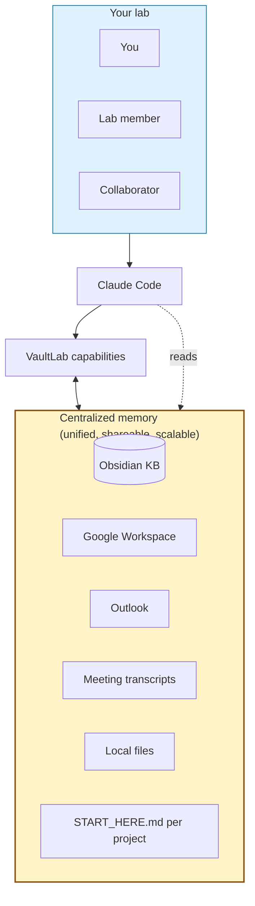

<h1 align="center">VaultLab</h1>

<p align="center">
  <b>An AI research companion for biological scientists.</b><br>
  Goes as deep as you want — literature, data, figures, manuscripts, slides. <i>Driven by you, on your terms.</i>
</p>

<p align="center">
  <a href="https://pypi.org/project/vaultlab/"></a>
  <a href="https://pypi.org/project/vaultlab/"></a>
  <a href="LICENSE"></a>
  <a href="https://github.com/bobbyni819/vaultlab/actions"></a>
  <a href="docs/KNOWN_LIMITATIONS.md"></a>
</p>

<!-- HERO GRAPHIC GOES HERE
     1200x400 banner with VaultLab name, tagline, 4-icon row.
     File: assets/hero.png. See docs/graphics-guide.md.
-->

> **🚧 Alpha software** — see [`docs/KNOWN_LIMITATIONS.md`](docs/KNOWN_LIMITATIONS.md). v0.1.0 target: late May 2026.

---

## 🌟 The flagship — centralized memory for your whole research life

<p align="center"><b>Other tools forget you between sessions. VaultLab remembers everything, forever.</b></p>

VaultLab knits **every fragmented source of context about your work** into one place the LLM reads. The KB grows project-by-project; cross-project insights emerge automatically.

| | |
|---|---|
| 📓 **Knowledge base** | Plain-markdown KB (Obsidian-native). Papers, notes, findings, manuscripts, figures — everything you write goes here, everything VaultLab reads comes from here. |
| 🎤 **Meeting transcripts** | Record meetings, auto-transcribe (local Whisper or cloud). *"What did we decide about cluster 7 last Tuesday?"* becomes a question VaultLab answers from the transcript it ingested. |
| 📥 **Inbox + calendar + work log** | Reads your Outlook (Windows) or Gmail + Google Docs lab work log + Calendar. *"Brief me on this morning"* — VaultLab knows what's pressing without you telling it. |
| 💾 **Local files** | Anything Claude Code can read on your machine. No upload, no proxy. |
| 🚀 **Auto-resumed projects** | Every project has a `START_HERE.md` that VaultLab maintains. Coming back after 3 days? Read one file, you're caught up in 30 seconds. |

**Three things this enables that no other research tool offers:**

- **Onboarding scales by sharing.** Add a lab member to your shared Drive folder + KB folder — they have the full project context. *No more "let me catch you up."*
- **Nothing is lost.** Recorded meetings + ingested papers + auto-written analysis notes + verified citations all queryable. *The information you need is always somewhere.*
- **The system gets smarter the more you use it.** Cross-project insights surface automatically: *"You saw a similar exhausted-T-cell phenotype in your 2026-03 tonsil run."*

---

## What VaultLab does on top of that memory

<table>
<tr>
<td width="50%">

### 📊 **Drafts entire figures from your data**

Not just "wraps matplotlib." VaultLab has a curated **recipe library** — every recipe cites ≥3 published examples. Tell it *"make a marker dot-plot for these clusters"* and you get a publication-tight figure with auto-generated caption, drawn from a pattern that's been used in real Cell / Nature papers. No invented visualizations.

</td>
<td width="50%">

### 📄 **NotebookLM-style citations**

Drafts methods sections with `[N]` markers, then verifies every one **semantically** against the actual source paper. Hover over a citation in your draft — see the exact passage that supports it. Hallucinated citations get flagged automatically; VaultLab refuses to ship if any unresolved.

</td>
</tr>
<tr>
<td width="50%">

### 🎤 **Paper → journal-club deck in 90 seconds**

`/paper-to-slides 10.1038/...` extracts figures from a PDF, composes a 12-slide deck with auto-generated speaker notes, exports `.pptx`. The flagship demo. *No other tool does this.*

</td>
<td width="50%">

### 🧬 **Wraps the analysis tools you trust**

scanpy, squidpy, scikit-image, Cellpose, scipy.stats, statsmodels, pingouin — VaultLab has a curated index so the LLM picks **real functions from real packages**, not raw web searches that hallucinate function names.

</td>
</tr>
</table>

> [!IMPORTANT]
> **VaultLab is a companion you customize, build upon, and direct.** Take the agent as far as you want — quick assist or full lab-wide deep-dive. *Other tools force a single mode; VaultLab adapts to the depth your work needs.*

---

## Get started

```bash
git clone https://github.com/bobbyni819/vaultlab && cd vaultlab
pip install -e ".[all]"
```

Then open [Claude Code](https://claude.com/claude-code) in the folder and paste:

```
I've just cloned VaultLab. Read README.md, CLAUDE.md, AGENTS.md, and
docs/getting-started.md, then walk me through what it does, what I
need to install, set up my first project, and run my first slash command.
Hedged voice on placeholder capabilities.
```

That's it. Claude Code interviews you about your work, sets up your KB + first project, walks you through the first command. ~10–15 minutes.

> **No Anthropic API key needed.** VaultLab is Claude-Code-native — Claude Code provides LLM access. The optional API keys are for **literature search** (NCBI, Semantic Scholar, etc.) — see [`docs/setup-api-keys.md`](docs/setup-api-keys.md). NCBI is free + 5 min and is the only one most users need.

<details>
<summary><b>Prefer to read setup docs yourself first?</b></summary>

- ⭐ [`docs/getting-started.md`](docs/getting-started.md) — full first-10-minutes walkthrough + 10 best practices
- [`docs/setup-obsidian.md`](docs/setup-obsidian.md) — Obsidian + recommended plugins
- [`docs/setup-api-keys.md`](docs/setup-api-keys.md) — literature API keys (NCBI, S2, Springer, Elsevier)
- [`docs/setup-google.md`](docs/setup-google.md) — Google Cloud Console + OAuth (~10 min)
- [`docs/setup-outlook-windows.md`](docs/setup-outlook-windows.md) — Outlook (Windows only)

</details>

---

## How it works



You (or anyone you've shared the KB with) talks to Claude Code. Claude Code reads VaultLab + memory. VaultLab orchestrates work, writes results back into the memory. Memory is **plain markdown** on Google Drive — share it like any folder, scale across your lab without infrastructure.

---

<details>
<summary><b>Specialized modules per modality</b> (CODEX, MALDI, spatial transcriptomics, scRNA-seq, imaging, flow)</summary>

VaultLab has modules tuned to specific modalities for spatial-omics-heavy research:

- **CODEX multiplex IF** — segmentation (Mesmer/Cellpose/StarDist), marker normalization, cellular neighborhood detection (Schürch 2020 + lab CN methodology)
- **MALDI imaging** — pyimzML + Cardinal-via-rpy2 wrappers, ion-image visualization, multi-modal coregistration with H&E
- **Spatial transcriptomics** — Visium / Xenium / SpatialData via squidpy
- **Single-cell RNA-seq** — scanpy + anndata canonical pipelines
- **Generic imaging / flow cytometry** — wrappers for standard tools

These are not required to use VaultLab; they're there if your work touches them. Generic AI tools wrap whatever's on PyPI — VaultLab's modality modules carry the methods working researchers actually use, not the generic defaults.

</details>

<details>
<summary><b>Architecture philosophy</b> (4 commitments)</summary>

1. **Markdown is the user-facing interface; Python is the engine.** Slash commands, role prompts, recipes are markdown — Claude Code reads them directly.
2. **Anti-laziness on semantic reading.** Every LLM call requires quoted evidence. No surface-skim.
3. **Result-oriented agentic loop.** You describe a goal; VaultLab plans + verifies + refines internally; you see the finished result.
4. **KB is the smartness.** No vector DBs, no hidden state. Markdown grows with your work; cross-project reasoning emerges via retrieval.

Full spec: [`docs/architecture.md`](docs/architecture.md). Invariants for contributors: [`AGENTS.md`](AGENTS.md).

</details>

<details>
<summary><b>What's unique vs PaperQA / scanpy / FutureHouse / scverse / Aider</b></summary>

| Capability | VaultLab | PaperQA2 | scanpy | FutureHouse | scverse | Aider |
|---|---|---|---|---|---|---|
| Wet-lab data analysis | ✓ | ✗ | ✓ | ✗ | ✓ | ✗ |
| Literature + citation verification | ✓ | ✓ | ✗ | ✓ | ✗ | ✗ |
| **NotebookLM-style evidence retrieval** | ✓ | partial | ✗ | ✗ | ✗ | ✗ |
| Manuscript drafting | ✓ | ✗ | ✗ | partial | ✗ | ✗ |
| **Slide deck output** | ✓ | ✗ | ✗ | ✗ | ✗ | ✗ |
| **Calendar / inbox / meeting context** | ✓ | ✗ | ✗ | ✗ | ✗ | ✗ |
| **Knowledge base (Obsidian-native, shareable)** | ✓ | ✗ | ✗ | ✗ | ✗ | ✗ |
| **Auto-resumed projects via START_HERE.md** | ✓ | ✗ | ✗ | ✗ | ✗ | ✗ |
| Local-first | ✓ | ✓ | ✓ | ✗ | ✓ | ✓ |
| **Companion mode (you control depth)** | ✓ | partial | n/a | ✗ | n/a | ✓ |
| Claude-Code-native skill bundle | ✓ | ✗ | ✗ | ✗ | ✗ | partial |

The combination is the value. Several rows nobody else even attempts. If you only need one piece, those tools are great. If you want a research companion that knows your whole lab, VaultLab is the only option.

</details>

---

## Roadmap

| Version | When | What works |
|---|---|---|
| **v0.0.1** | shipped 2026-04-28 | Scaffold + docs. `figures.publication`, `context.google`, `context.outlook` real. Most other modules are placeholders. 27 unit tests passing. |
| **v0.1.0** | target 2026-05-27 | Real `research`, `citations`, `figures.recipes`, `slides`, `kb`, `runner`. ~30 slash commands. End-to-end demo works. arXiv preprint draft. |
| **v0.2.0** | autumn 2026 | MCP server. Full meeting-recorder integration. Cross-model judge. macOS/Linux meeting backend. |
| **v1.0.0** | TBD | Stable API, lab adoption, documented benchmarks. |

See [`docs/KNOWN_LIMITATIONS.md`](docs/KNOWN_LIMITATIONS.md) for current placeholders.

---

<details>
<summary><b>Documentation</b></summary>

**Reference:** [`docs/architecture.md`](docs/architecture.md) · [`.claude/commands/COMMANDS.md`](.claude/commands/COMMANDS.md) · [`docs/comparison.md`](docs/comparison.md) · [`AGENTS.md`](AGENTS.md) · [`CLAUDE.md`](CLAUDE.md)

**Privacy:** [`docs/data-privacy.md`](docs/data-privacy.md) · [`docs/compliance.md`](docs/compliance.md) · [`docs/long-term-reproducibility.md`](docs/long-term-reproducibility.md)

**Lineage:** [`INSPIRATIONS.md`](INSPIRATIONS.md) · [`docs/ORIGINAL-CONTRIBUTIONS.md`](docs/ORIGINAL-CONTRIBUTIONS.md)

**Contributors:** [`CONTRIBUTING.md`](CONTRIBUTING.md) · [`docs/graphics-guide.md`](docs/graphics-guide.md)

</details>

---

## Acknowledgments

VaultLab is built on the shoulders of many open-source projects. Foundational influences include [virtual-lab](https://github.com/zou-group/virtual-lab) (multi-agent meeting structure), [AI-Scientist](https://github.com/SakanaAI/AI-Scientist) (autonomous research patterns), [paperclip](https://github.com/GXL-ai/paperclip) (literature MCP), [gstack](https://github.com/garrytan/gstack) (Claude Code skill bundle philosophy + AGENTS.md framing), [scanpy/squidpy](https://github.com/scverse) (canonical bioinformatics analysis), [Cellpose](https://github.com/MouseLand/cellpose), [Schürch et al. 2020](https://doi.org/10.1016/j.cell.2020.07.005) (cellular neighborhoods), and [Karpathy's nanoGPT](https://github.com/karpathy/nanoGPT) (fork-and-clone primary distribution philosophy).

Full attribution + lineage: [`INSPIRATIONS.md`](INSPIRATIONS.md). What's uniquely VaultLab vs synthesis vs borrowed: [`docs/ORIGINAL-CONTRIBUTIONS.md`](docs/ORIGINAL-CONTRIBUTIONS.md).

VaultLab is developed at the [Hickey Lab](https://www.hickeylab.org), Duke University Biomedical Engineering.

---

## Citation, privacy, license

```bibtex
@software{ni_vaultlab_2026,
  author = {Ni, Bobby Y.X.},
  title = {VaultLab: A research companion for biological scientists},
  year = 2026, url = {https://github.com/bobbyni819/vaultlab}
}
```

**Privacy:** prompt content is sent to Anthropic's Claude API via Claude Code. **Not HIPAA-compliant.** Do not use with PHI/PII/IRB-restricted data. See [`docs/data-privacy.md`](docs/data-privacy.md) for the quick-compliance check.

**License:** [MIT](LICENSE). Author: Bobby Y.X. Ni — Hickey Lab, Duke University Biomedical Engineering.
