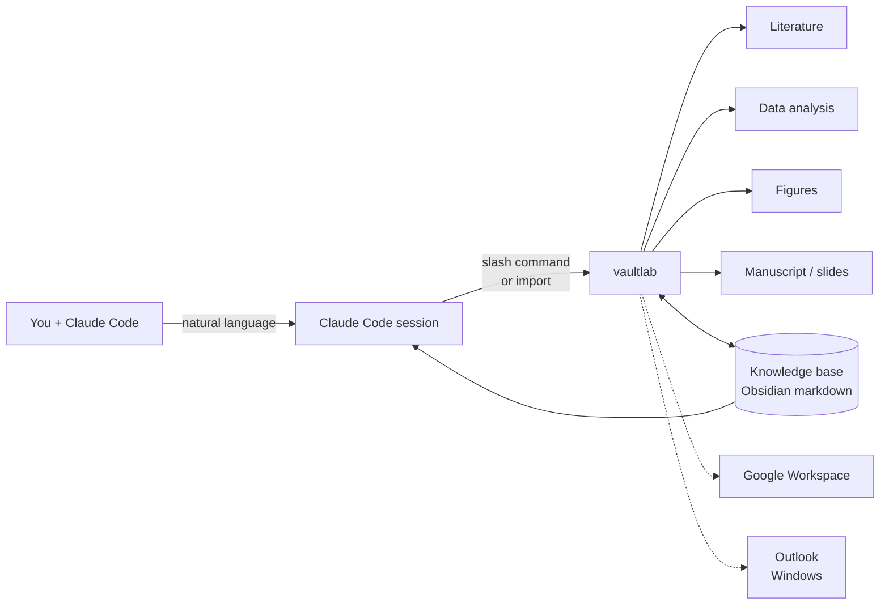

# vaultlab

> **An AI research companion for biological scientists.**
>
> Goes as deep as you want — literature search, data analysis, figure generation, manuscript drafting, slide decks. Driven by you, on your terms.

[](https://pypi.org/project/vaultlab/)
[](https://pypi.org/project/vaultlab/)
[](LICENSE)
[](https://github.com/bobbyni819/vaultlab/actions)

> **🚧 Alpha software** — see [`docs/KNOWN_LIMITATIONS.md`](docs/KNOWN_LIMITATIONS.md). v0.1.0 target: late May 2026.

<!-- HERO GRAPHIC GOES HERE
     Suggested: 1200x400 banner with vaultlab name, tagline, and a 4-icon row
     showing the four pillars (Literature / Data / Figures / Slides). Or a short
     animated GIF demonstrating one slash command end-to-end.
     File: assets/hero.png or assets/hero.gif (~2 MB max for fast README render)
     Tools: Figma, Excalidraw, Canva, or AI image gen.
-->

---

## What it is

vaultlab is a [Claude Code](https://claude.com/claude-code) capability layer that follows you through whatever you're doing today. Searching literature. Analyzing data. Drafting a paragraph. Making a figure. Building tomorrow's deck.

Not autonomous. Not generic. **Biology-aware, depth-on-demand, local-first.**

## Get started in 3 steps (~15 minutes)

### 1. Install

```bash
git clone https://github.com/bobbyni819/vaultlab && cd vaultlab
pip install -e ".[all]"
```

(Or `pip install vaultlab` from PyPI for the library only, without slash commands.)

### 2. Open Claude Code in this folder, paste this prompt

After clone + install, open [Claude Code](https://claude.com/claude-code) in the `vaultlab` folder and paste:

```
I've just cloned vaultlab. Please read README.md, CLAUDE.md, AGENTS.md,
and docs/getting-started.md, then walk me through:
  1. What vaultlab does and what it doesn't
  2. What I need to install (Obsidian, API keys, etc.)
  3. Setting up my first project — ask me what research I'm working on,
     where my files live, and where I want my knowledge base to be
  4. Running my first slash command

Be patient with me — this is my first time using vaultlab. Hedged voice
when discussing capabilities (some are still v0.0.1 placeholders).
```

Claude Code reads the docs, then **interviews you about your work**, sets up your first project + knowledge base, and walks you through your first useful command.

### 3. Reference docs (if you want to read yourself first)

- ⭐ [`docs/getting-started.md`](docs/getting-started.md) — full first-10-minutes walkthrough + 10 best practices
- [`docs/setup-obsidian.md`](docs/setup-obsidian.md) — Obsidian download + plugin setup
- [`docs/setup-api-keys.md`](docs/setup-api-keys.md) — Anthropic + literature API keys
- [`docs/setup-google.md`](docs/setup-google.md) — Google Cloud Console + OAuth (~10 min)
- [`docs/setup-outlook-windows.md`](docs/setup-outlook-windows.md) — Outlook (Windows only)

---

## The big idea — a centralized memory for your research

The most underrated thing vaultlab does: it ties **every fragmented source of context about your work into one place** the LLM can read. The result is a research companion that actually knows what's going on, not a generic chatbot you have to re-explain things to every session.

| Source | What's captured | How |
|---|---|---|
| **Knowledge base** (Obsidian-native, plain markdown) | Papers, notes, summaries, findings, concepts, manuscripts, figures | Every analysis writes; every analysis reads |
| **Google Workspace** | Your lab work log (Docs), sample manifests (Sheets), shared files (Drive), pressing emails (Gmail), today's schedule (Calendar) | OAuth, opt-in per scope |
| **Outlook** (Windows) | Inbox + calendar + tasks + drafts with your signature | COM automation, no proxy |
| **Meeting transcripts** (Windows, opt-in) | Full audio + transcript of every recorded meeting | meeting_recorder + Whisper local/cloud |
| **Local filesystem** | Anything Claude Code can read | You just point at the folder |
| **Project state** | Current focus, recent activity, files-to-read-first | Auto-maintained `START_HERE.md` per project |

**Three implications worth calling out:**

1. **Onboarding scales by sharing.** Add a lab member to your Google Drive shared folder + your KB folder, and they instantly have the entire project context. No more "let me catch you up" — the catchup is a `Read(START_HERE.md)`.
2. **Nothing is lost.** Recorded meetings + ingested papers + auto-written analysis notes + verified citations all land in the KB with rich frontmatter. The information you need is always *somewhere queryable*, not in the bottom of a Slack thread or the back of someone's notebook.
3. **The system gets smarter as you use it.** Cross-project insights emerge: *"You saw a similar exhausted-T-cell phenotype in the 2026-03 tonsil run."* The KB grows; retrieval over the growing markdown corpus is the differentiator.

---

## Four pillars on top of that memory (v0.1.0 target — May 2026)

> **Heads-up:** v0.0.1 (current) is a scaffold with structure in place. The capabilities below land progressively in v0.1.0. See [Roadmap](#roadmap) for what works now vs what's coming.

<!-- CAPABILITY DIAGRAM GOES HERE
     Suggested: 4-quadrant graphic with icons. Or a Mermaid flowchart showing
     how the pillars connect through the knowledge base.
     File: assets/capability-grid.png
-->

| Pillar | What it does |
|---|---|
| 📄 **Literature & citations** | Search across the literature sources you have API access to (PubMed, Semantic Scholar, CrossRef, bioRxiv, Springer, Elsevier, paperclip MCP — configure what's available in your `secrets.toml`). Verify every `[N]` semantically against the source passage; flag hallucinations. |
| 🧬 **Data analysis** | Wraps mature Python tools (scanpy, squidpy, scikit-image, Cellpose for spatial / single-cell / imaging; scipy.stats, statsmodels, pingouin for general inference). Ships a curated **tools index** so the LLM knows when to use which package — no raw web searches at runtime. Hedges on interpretation, never invents results. |
| 📊 **Figures** | Corpus-backed recipes (every recipe cites ≥3 published examples). Publication-tight by default, presentation-loose on demand. |
| ✍️ **Manuscripts & slides** | Drafts methods/results sections with verified citations. Builds slide decks from research outputs (the flagship). |

The pillars all read from + write to the centralized memory above. *That's* what makes vaultlab a companion: the pillars know what you've already done.

---

## Project onboarding (how a new researcher gets up to speed)

Point vaultlab at a new project folder; it reads the structure, builds an understanding, asks clarifying questions, and initializes a `START_HERE.md` that future sessions read first to resume in 30 seconds:

```
> /onboard-project ~/Downloads/my_research_project
```

See [`docs/getting-started.md`](docs/getting-started.md) for the full workflow.

---

## How it works



You talk to Claude Code. Claude Code reads vaultlab's slash commands and skills. vaultlab orchestrates real work — wraps mature scientific tools, calls Claude for interpretation, writes everything to your KB. The KB is the long-term memory; vaultlab gets smarter project-by-project as it grows.

---

## Specialized modules

Beyond the general pillars, vaultlab includes lab-specific modules built around our research at the Hickey Lab (Duke BME):

- **CODEX multiplex IF** — segmentation (Mesmer/Cellpose/StarDist), marker normalization, cellular neighborhood detection (Schürch 2020 + Hickey lab anchored)
- **MALDI imaging** — pyimzML + Cardinal-via-rpy2 wrappers, ion-image visualization, multi-modal coregistration with H&E
- **Spatial transcriptomics** — Visium / Xenium / SpatialData via squidpy
- **Single-cell RNA-seq** — scanpy + anndata canonical pipelines
- **Generic imaging + flow cytometry** — wrappers for the standard tools

These aren't required to use vaultlab. They're there if your work touches them.

---

## Architecture philosophy

vaultlab is a **capability layer FOR Claude Code**, not a competing harness. Markdown is the user-facing interface; Python is the engine. Slash commands, role prompts, recipes, layouts, and skill definitions are all markdown files Claude Code reads at first repo open.

### Four core commitments

1. **Markdown is the interface; Python is the engine.**
2. **Anti-laziness on semantic reading.** Every LLM call requires quoted evidence.
3. **Result-oriented.** You describe a goal; vaultlab plans + verifies + refines internally; you see the finished result.
4. **KB is the smartness.** No vector DBs, no hidden state. Just markdown that grows with your work.

See [`docs/architecture.md`](docs/architecture.md), [`AGENTS.md`](AGENTS.md), and [`CLAUDE.md`](CLAUDE.md).

---

## What makes vaultlab different

<!-- COMPARISON / POSITIONING GRAPHIC GOES HERE
     Suggested: Venn diagram or capability matrix showing vaultlab vs PaperQA /
     scanpy / FutureHouse / scverse / Aider. Highlight the unique combination.
     File: assets/comparison.png
-->

No tool combines literature verification + wet-lab data + manuscript drafting + slide output + life-context (calendar, inbox, work log) wired through Claude Code. If you want one piece, those tools are great; vaultlab is for the combination.

See [`docs/comparison.md`](docs/comparison.md).

---

## Roadmap

| Version | When | What works |
|---|---|---|
| **v0.0.1** (current) | shipped 2026-04-28 | Repo scaffold + full documentation. `vaultlab.figures.publication` (publication-styling helpers), `vaultlab.context.google` + `vaultlab.context.outlook` (lifted from bobby-tools), 4 GitHub workflows (test, DCO, release-to-PyPI). 27 unit tests passing. Most subpackages are placeholders. |
| **v0.1.0** | target 2026-05-27 | Real `vaultlab.research` (multi-source lit search), `vaultlab.citations` (3-tier semantic verification), `vaultlab.figures.recipes` (≥5 corpus-backed recipes), `vaultlab.slides` (deck generation), `vaultlab.kb` (Obsidian setup + ingest + semantic search), `vaultlab.runner` (bounded loop + verifiers). All ~30 slash commands wired up. End-to-end `vaultlab demo pbmc3k` works. arXiv preprint draft. |
| **v0.2.0** | autumn 2026 | MCP server. `vaultlab.context.meetings` (full meeting_recorder integration). Cross-model judge. Cross-project insight transfer. `examples/codex_hubmap_tonsil/` flagship demo. macOS/Linux meeting backend. |
| **v1.0.0** | TBD | Stable API. First-class lab adoption. Documented benchmarks. |

See [`docs/KNOWN_LIMITATIONS.md`](docs/KNOWN_LIMITATIONS.md) for what's currently a placeholder.

---

## Documentation

**Setup:**
- ⭐ [`docs/getting-started.md`](docs/getting-started.md) — **start here** — first-10-minutes walkthrough + best practices for using vaultlab day-to-day
- [`docs/setup-obsidian.md`](docs/setup-obsidian.md) — Obsidian + plugins
- [`docs/setup-api-keys.md`](docs/setup-api-keys.md) — Anthropic + literature APIs
- [`docs/setup-google.md`](docs/setup-google.md) — Google Workspace OAuth
- [`docs/setup-outlook-windows.md`](docs/setup-outlook-windows.md) — Outlook (Windows)

**Reference:**
- [`docs/architecture.md`](docs/architecture.md) — full architectural spec
- [`.claude/commands/COMMANDS.md`](.claude/commands/COMMANDS.md) — slash command inventory (what you can invoke from Claude Code)
- [`docs/graphics-guide.md`](docs/graphics-guide.md) — figure design principles for contributors
- [`docs/comparison.md`](docs/comparison.md) — vs other tools (TODO populate)
- [`AGENTS.md`](AGENTS.md) — invariants for code contributors
- [`CLAUDE.md`](CLAUDE.md) — entrypoint for Claude Code sessions

**Lineage & contributions:**
- [`INSPIRATIONS.md`](INSPIRATIONS.md) — what we drew from where (auditable)
- [`docs/ORIGINAL-CONTRIBUTIONS.md`](docs/ORIGINAL-CONTRIBUTIONS.md) — what's original vs synthesis vs borrowed

**Privacy & limits:**
- [`docs/data-privacy.md`](docs/data-privacy.md) — what data leaves your machine
- [`docs/compliance.md`](docs/compliance.md) — explicit non-HIPAA disclosure
- [`docs/long-term-reproducibility.md`](docs/long-term-reproducibility.md)
- [`docs/KNOWN_LIMITATIONS.md`](docs/KNOWN_LIMITATIONS.md) — honest failures

**For contributors:** [`CONTRIBUTING.md`](CONTRIBUTING.md)

---

## Citation

```bibtex
@software{ni_vaultlab_2026,
  author  = {Ni, Bobby Y.X.},
  title   = {vaultlab: A research companion for biological scientists},
  year    = 2026,
  url     = {https://github.com/bobbyni819/vaultlab},
  version = {0.0.1}
}
```

See [`CITATION.cff`](CITATION.cff).

---

## Privacy & compliance

vaultlab uses Anthropic's Claude API. Prompt content is sent to Anthropic. **Not HIPAA-compliant.** Do not use with PHI/PII/IRB-restricted data. See [`docs/data-privacy.md`](docs/data-privacy.md) and [`docs/compliance.md`](docs/compliance.md). You take full responsibility for compliance with your institutional, IRB, IACUC, and regulatory obligations.

---

## Author & license

Bobby Y.X. Ni — Hickey Lab, Duke University Biomedical Engineering.

[MIT](LICENSE) — anyone can use, modify, distribute, including commercial.
