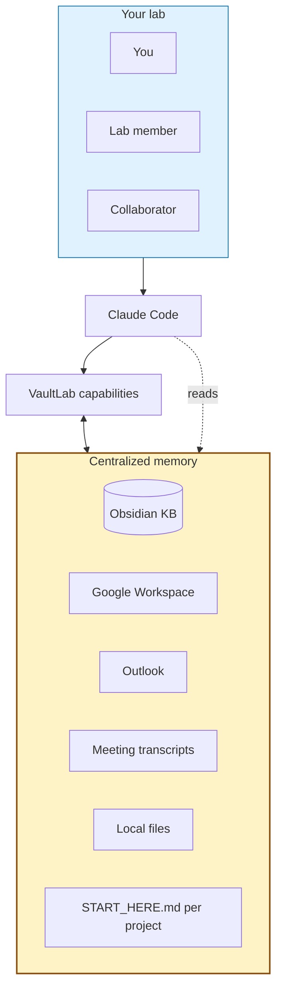

<h1 align="center">VaultLab</h1>

<p align="center">
  <b>The Claude Code setup for biological research.</b><br>
  Centralized lab memory + literature + data analysis + figures + manuscripts + slides — directed by you, run by Claude Code.
</p>

<p align="center">
  <a href="https://pypi.org/project/vaultlab/"></a>
  <a href="https://pypi.org/project/vaultlab/"></a>
  <a href="LICENSE"></a>
  <a href="https://github.com/bobbyni819/vaultlab/actions"></a>
  <a href="docs/KNOWN_LIMITATIONS.md"></a>
</p>

> *"Most lit-search tools answer one question. VaultLab is what happens when your literature, your wet-lab data, your meeting transcripts, your inbox, and your manuscript live in one place that an LLM can read."*

**VaultLab lives inside [Claude Code](https://claude.com/claude-code).** Open Claude Code in a folder. VaultLab adds ~30 slash commands (`/lit-arc`, `/build-deck`, `/cite audit`, `/onboard-project`, `/lit-report`) that Claude Code reads as plain markdown. No Anthropic API key needed — Claude Code provides the LLM. KB is plain markdown on Google Drive, OneDrive, a lab NAS, or any folder that syncs. **If you've used Claude Code, you already know how to use VaultLab.**

> **Alpha software.** v0.1.0 target: late May 2026. Honest gap inventory: [`docs/KNOWN_LIMITATIONS.md`](docs/KNOWN_LIMITATIONS.md).

---

## About

PhD student in biomedical engineering at Duke (Hickey Lab) — wet-lab spatial omics + computational.

Research at scale is fragmented. Meetings in Outlook. Papers in Drive. Notes on a lab NAS. Archives on university OneDrive. Decisions made in conversations nobody wrote down. The university hands you several storage locations; the lab adds its own. Context lives everywhere except where the LLM is looking.

VaultLab reads across those ecosystems and centralizes them inside Claude Code. KB is plain markdown — runs on whatever storage you already have.

I've used the Claude API to automate workflows with autonomous agents. Token cost still doesn't justify the marginal lift. What's worked is being hands-on inside Claude Code with the LLM as an amplifier — that's been the real game changer. Watching others ship — [gstack](https://github.com/garrytan/gstack), [nanoGPT](https://github.com/karpathy/nanoGPT), [virtual-lab](https://github.com/zou-group/virtual-lab), [AI-Scientist](https://github.com/SakanaAI/AI-Scientist), other research-specific agent systems — was the push to ship mine and join the open-source wave. Most of what's here adapts beyond research; KB, citation auditing, and slide composition work on any topic.

---

## What VaultLab actually does

Inside Claude Code, VaultLab reads your whole research ecosystem and writes back into it. Five context sources, one place the LLM looks:

| Source | What VaultLab does with it |
|---|---|
| **Knowledge base** (Obsidian-native markdown) | Per-paper summaries with citation graph, lineage arcs, project pages, manuscript drafts — all linked by `[[wikilinks]]`. Grows with your work. |
| **Literature** (NCBI, Semantic Scholar, Springer, Elsevier, bioRxiv, CrossRef) | Multi-source search → citation-graph metrics (OG-score, forward-influence, year-buckets) → LLM-driven lineage binning → grounded summaries with `[pN]` page markers. |
| **Meeting transcripts** | Record + auto-transcribe (local Whisper or cloud). *"What did we decide about cluster 7 last Tuesday?"* — answered from the transcript. |
| **Inbox + calendar + work log** | Outlook (Windows) or Gmail + Google Docs lab log + Calendar. *"Brief me on this morning"* works without you setting context. |
| **Project state** | Every project has a `START_HERE.md` VaultLab maintains. Read one file, you're caught up in 30 seconds. Cross-project insights surface automatically: *"You saw a similar exhausted-T-cell phenotype in your 2026-03 tonsil run."* |

Onboard a lab member by sharing the Drive folder. That's the whole onboarding.

---

## What VaultLab does on top of that memory

<table>
<tr>
<td width="50%">

### Drafts entire figures from your data

Not just "wraps matplotlib." VaultLab has a curated **recipe library** — every recipe cites ≥3 published examples. Tell it *"make a marker dot-plot for these clusters"* and you get a publication-tight figure with auto-generated caption, drawn from a pattern that's been used in real Cell / Nature papers. No invented visualizations.

</td>
<td width="50%">

### Citations with traceable evidence

Drafts methods sections with `[N]` markers, then verifies every one **semantically** against the actual source paper. Hover a citation in your draft to see the exact passage that supports it. Hallucinated citations get flagged automatically; VaultLab refuses to ship if any are unresolved.

</td>
</tr>
<tr>
<td width="50%">

### Slide decks from anything

`/build-deck <source>` composes a deck — figures, captions, speaker notes, click-through animations — from whatever you point it at. A paper PDF, your own wet-lab data, a manuscript draft, or just a topic VaultLab pulls from your KB. Exports `.pptx`. Works for journal clubs, lab meetings, conference talks, dissertation defenses.

</td>
<td width="50%">

### Wraps the analysis tools you trust

scanpy, squidpy, scikit-image, Cellpose, scipy.stats, statsmodels, pingouin — VaultLab has a curated index so the LLM picks **real functions from real packages**, not raw web searches that hallucinate function names.

</td>
</tr>
<tr>
<td width="50%">

### Multi-agent crosstalk for hard questions

`/lit-report` runs analyst → critic → synthesizer over a corpus to produce a 3000–5000 word grounded review. Adversarial picker meeting catches off-topic seminal papers; rigor auditor blocks decks that ship with unverified claims. The bigger the question, the more agents weigh in.

</td>
<td width="50%">

### LLM-driven lineage binning

Reads abstracts of every paper in a corpus and decides *history / development / state-of-the-art* by conceptual lineage, not just publication year. A 2018 method paper goes in *history* if it's foundational; a 2024 incremental application goes in *development*, not *sota*. Solves the empty-history-bin failure pure-quartile binning produces.

</td>
</tr>
</table>

> [!IMPORTANT]
> **A companion you customize and direct.** Quick assist or full lab-wide deep-dive — pick the depth. Other tools force a single mode; VaultLab adapts.

---

## Get started — inside Claude Code

If you don't have Claude Code yet, install it from [claude.com/claude-code](https://claude.com/claude-code). VaultLab is the bundle of slash commands + role prompts + Python machinery you point Claude Code at.

```bash
git clone https://github.com/bobbyni819/vaultlab && cd vaultlab
pip install -e ".[all]"
claude   # opens Claude Code in this folder; VaultLab's slash commands are now available
```

From inside Claude Code, pick the path that fits you:

| Path | When | First slash command |
|---|---|---|
| **A — Full project** | You have a folder with code, data, papers, notes | Copy `templates/project_intake.md` into your folder, fill it (5 min), then `/onboard-project <path>` |
| **B — Quick scoping** | Just curious about a topic — no folder yet | `/start-project "<your topic>"` |
| **C — Non-research** | Any knowledge-management use case | Same as B — VaultLab works for any topic, not just biomedical |

The intake form has 9 sections (topic, goal, audience, what-you-have, exclusions, style, PI prefs, deadlines, free-form). Required: topic + goal + audience. Everything else is optional. After onboarding, `/lit-arc`, `/build-deck`, `/cite audit`, `/lit-report` etc. all know your context — you don't re-explain the project to Claude every session.

Full walkthrough: [`docs/getting-started.md`](docs/getting-started.md). ~10–15 minutes total from clone to first useful KB entry.

> **No Anthropic API key needed.** VaultLab is Claude-Code-native — Claude Code provides LLM access. The optional API keys are for **literature search** (NCBI, Semantic Scholar, etc.) — see [`docs/setup-api-keys.md`](docs/setup-api-keys.md). NCBI is free + 5 min and is the only one most users need.

<details>
<summary><b>Prefer to read setup docs yourself first?</b></summary>

- [`docs/getting-started.md`](docs/getting-started.md) — full first-10-minutes walkthrough + 10 best practices
- [`docs/setup-obsidian.md`](docs/setup-obsidian.md) — Obsidian + recommended plugins
- [`docs/setup-api-keys.md`](docs/setup-api-keys.md) — literature API keys (NCBI, S2, Springer, Elsevier)
- [`docs/setup-google.md`](docs/setup-google.md) — Google Cloud Console + OAuth (~10 min)
- [`docs/setup-outlook-windows.md`](docs/setup-outlook-windows.md) — Outlook (Windows only)

</details>

---

## How it works



You (or anyone you've shared the KB with) talks to Claude Code. Claude Code reads VaultLab + memory. VaultLab orchestrates work, writes results back into the memory. Memory is **plain markdown** on Google Drive — share it like any folder, scale across your lab without infrastructure.

---

<details>
<summary><b>Specialized modules per modality</b> (CODEX, MALDI, spatial transcriptomics, scRNA-seq, imaging, flow)</summary>

VaultLab has modules tuned to specific modalities for spatial-omics-heavy research:

- **CODEX multiplex IF** — segmentation (Mesmer/Cellpose/StarDist), marker normalization, cellular neighborhood detection (Schürch 2020 + lab CN methodology)
- **MALDI imaging** — pyimzML + Cardinal-via-rpy2 wrappers, ion-image visualization, multi-modal coregistration with H&E
- **Spatial transcriptomics** — Visium / Xenium / SpatialData via squidpy
- **Single-cell RNA-seq** — scanpy + anndata canonical pipelines
- **Generic imaging / flow cytometry** — wrappers for standard tools

These are not required to use VaultLab; they're there if your work touches them. Generic AI tools wrap whatever's on PyPI — VaultLab's modality modules carry the methods working researchers actually use, not the generic defaults.

</details>

<details>
<summary><b>Architecture philosophy</b> (4 commitments)</summary>

1. **Markdown is the user-facing interface; Python is the engine.** Slash commands, role prompts, recipes are markdown — Claude Code reads them directly.
2. **Anti-laziness on semantic reading.** Every LLM call requires quoted evidence. No surface-skim.
3. **Result-oriented agentic loop.** You describe a goal; VaultLab plans + verifies + refines internally; you see the finished result.
4. **KB is the smartness.** No vector DBs, no hidden state. Markdown grows with your work; cross-project reasoning emerges via retrieval.

Full spec: [`docs/architecture.md`](docs/architecture.md). Invariants for contributors: [`AGENTS.md`](AGENTS.md).

</details>

<details>
<summary><b>What's unique vs PaperQA / scanpy / FutureHouse / scverse / Aider</b></summary>

| Capability | VaultLab | PaperQA2 | scanpy | FutureHouse | scverse | Aider |
|---|---|---|---|---|---|---|
| Wet-lab data analysis | ✓ | ✗ | ✓ | ✗ | ✓ | ✗ |
| Literature + citation verification | ✓ | ✓ | ✗ | ✓ | ✗ | ✗ |
| **Evidence-tied citation retrieval** | ✓ | partial | ✗ | ✗ | ✗ | ✗ |
| Manuscript drafting | ✓ | ✗ | ✗ | partial | ✗ | ✗ |
| **Slide deck output** | ✓ | ✗ | ✗ | ✗ | ✗ | ✗ |
| **Calendar / inbox / meeting context** | ✓ | ✗ | ✗ | ✗ | ✗ | ✗ |
| **Knowledge base (Obsidian-native, shareable)** | ✓ | ✗ | ✗ | ✗ | ✗ | ✗ |
| **Auto-resumed projects via START_HERE.md** | ✓ | ✗ | ✗ | ✗ | ✗ | ✗ |
| Local-first | ✓ | ✓ | ✓ | ✗ | ✓ | ✓ |
| **Companion mode (you control depth)** | ✓ | partial | n/a | ✗ | n/a | ✓ |
| Claude-Code-native skill bundle | ✓ | ✗ | ✗ | ✗ | ✗ | partial |

The combination is the value. Several rows nobody else even attempts. If you only need one piece, those tools are great. If you want a research companion that knows your whole lab, VaultLab is the only option.

</details>

<details>
<summary><b>Documentation index</b></summary>

**Reference:** [`docs/architecture.md`](docs/architecture.md) · [`.claude/commands/COMMANDS.md`](.claude/commands/COMMANDS.md) · [`AGENTS.md`](AGENTS.md) · [`CLAUDE.md`](CLAUDE.md)

**Use cases & workflows:** [`docs/use-cases.md`](docs/use-cases.md)

**Privacy:** [`docs/data-privacy.md`](docs/data-privacy.md) · [`docs/compliance.md`](docs/compliance.md) · [`docs/long-term-reproducibility.md`](docs/long-term-reproducibility.md)

**Lineage:** [`INSPIRATIONS.md`](INSPIRATIONS.md) · [`docs/design-rationale.md`](docs/design-rationale.md)

**Contributors:** [`CONTRIBUTING.md`](CONTRIBUTING.md) · [`docs/graphics-guide.md`](docs/graphics-guide.md)

</details>

---

## Methodological lineage

The patterns VaultLab uses are deliberately lifted from established, peer-reviewed, or widely-used open-source projects, then adapted into a Claude-Code-native harness:

| What VaultLab does | Pattern source |
|---|---|
| Multi-agent meeting structure (adversarial vs round-table) | [virtual-lab](https://github.com/zou-group/virtual-lab) (Zou group, Stanford) |
| Bounded plan→execute→verify→refine loop | [AI-Scientist](https://github.com/SakanaAI/AI-Scientist) (Sakana AI) |
| Literature MCP + cross-source dedup | [paperclip](https://github.com/GXL-ai/paperclip) |
| Claude Code skill bundle organization + AGENTS.md framing | [gstack](https://github.com/garrytan/gstack) |
| Canonical scRNA-seq / spatial pipelines | [scanpy + squidpy](https://github.com/scverse) (scverse community, peer-reviewed in *Nat. Methods*) |
| Cell segmentation primitives | [Cellpose](https://github.com/MouseLand/cellpose) (Stringer & Pachitariu, *Nat. Methods* 2021) |
| Cellular neighborhood detection | [Schürch et al. 2020, *Cell*](https://doi.org/10.1016/j.cell.2020.07.005) |
| Fork-and-clone primary distribution | [nanoGPT](https://github.com/karpathy/nanoGPT) (Karpathy) |

Each row represents a method or interface design choice that I read, understood, and adapted — not invented from scratch. The implementations are mine, but the patterns have track records elsewhere.

Full per-component attribution: [`INSPIRATIONS.md`](INSPIRATIONS.md). For a project-level breakdown of design choices novel to VaultLab vs. synthesis vs. borrowed: [`docs/design-rationale.md`](docs/design-rationale.md).

---

## Citation, privacy, license

```bibtex
@software{ni_vaultlab_2026,
  author = {Ni, Bobby Y.X.},
  title = {VaultLab: A research companion for biological scientists},
  year = 2026, url = {https://github.com/bobbyni819/vaultlab}
}
```

**Privacy:** prompt content is sent to Anthropic's Claude API via Claude Code. **Not HIPAA-compliant.** Do not use with PHI/PII/IRB-restricted data. See [`docs/data-privacy.md`](docs/data-privacy.md) for the quick-compliance check.

**License:** [MIT](LICENSE).
