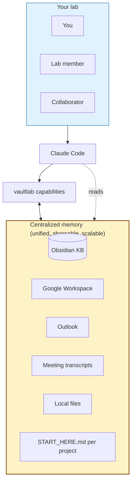

<h1 align="center">vaultlab</h1>

<p align="center">
  <b>An AI research companion for biological scientists.</b><br>
  Goes as deep as you want — literature, data, figures, manuscripts, slides. <i>Driven by you, on your terms.</i>
</p>

<p align="center">
  <a href="https://pypi.org/project/vaultlab/"></a>
  <a href="https://pypi.org/project/vaultlab/"></a>
  <a href="LICENSE"></a>
  <a href="https://github.com/bobbyni819/vaultlab/actions"></a>
  <a href="docs/KNOWN_LIMITATIONS.md"></a>
</p>

<!-- HERO GRAPHIC GOES HERE
     1200x400 banner with vaultlab name, tagline, 4-icon row.
     File: assets/hero.png. See docs/graphics-guide.md.
-->

> **🚧 Alpha software** — see [`docs/KNOWN_LIMITATIONS.md`](docs/KNOWN_LIMITATIONS.md). v0.1.0 target: late May 2026.

---

## ⭐ Things vaultlab does that nobody else does

<table>
<tr>
<td width="33%" align="center">

### 🎤 **Records your meetings**

Auto-transcribes via Whisper (local GPU or cloud), ingests into your KB. *"What did John say about cluster 7 last Tuesday?"* becomes a question vaultlab can answer.

</td>
<td width="33%" align="center">

### 📥 **Reads your inbox + calendar**

Outlook (Windows) or Gmail (any OS). vaultlab knows what's pressing this week without you having to tell it. *"Brief me on this morning."*

</td>
<td width="33%" align="center">

### 🧠 **Centralized memory across your whole lab**

Add a teammate to your shared Drive folder; they have the full project context. No more *"let me catch you up."*

</td>
</tr>
<tr>
<td width="33%" align="center">

### 📄 **NotebookLM-style citations**

Hover over any `[3]` in a draft → see the exact passage from the source paper. Hallucinated citations get flagged automatically; vaultlab refuses to ship if any unresolved.

</td>
<td width="33%" align="center">

### 📊 **Figures with provenance**

Every figure recipe cites ≥3 published examples. *"Why did you pick this visualization?"* — vaultlab can answer with DOIs.

</td>
<td width="33%" align="center">

### 🎤 **From paper to journal-club deck in 90 seconds**

`/paper-to-slides 10.1038/...` extracts figures, composes 12 slides with auto-generated speaker notes, exports `.pptx`. The flagship demo.

</td>
</tr>
</table>

> [!IMPORTANT]
> **vaultlab is a companion you customize, build upon, and direct.** Take the agent as far as you want — quick assist or full lab-wide deep-dive. *Other tools force a single mode; vaultlab adapts to the depth your work needs.*

---

## Get started

```bash
git clone https://github.com/bobbyni819/vaultlab && cd vaultlab
pip install -e ".[all]"
```

Then open [Claude Code](https://claude.com/claude-code) in the folder and paste:

```
I've just cloned vaultlab. Read README.md, CLAUDE.md, AGENTS.md, and
docs/getting-started.md, then walk me through what it does, what I
need to install, set up my first project, and run my first slash command.
Hedged voice on placeholder capabilities.
```

That's it. Claude Code interviews you about your work, sets up your KB + first project, walks you through the first command. ~10–15 minutes.

<details>
<summary><b>Prefer to read setup docs yourself first?</b></summary>

- ⭐ [`docs/getting-started.md`](docs/getting-started.md) — full first-10-minutes walkthrough + 10 best practices
- [`docs/setup-obsidian.md`](docs/setup-obsidian.md) — Obsidian + recommended plugins
- [`docs/setup-api-keys.md`](docs/setup-api-keys.md) — Anthropic + literature API keys
- [`docs/setup-google.md`](docs/setup-google.md) — Google Cloud Console + OAuth (~10 min)
- [`docs/setup-outlook-windows.md`](docs/setup-outlook-windows.md) — Outlook (Windows only)

</details>

---

## The big idea: a centralized memory for your research

vaultlab knits every fragmented source of context about your work into one place the LLM can read:

- **Knowledge base** (Obsidian-native markdown) — papers, notes, findings, manuscripts
- **Google Workspace** — work log, sample sheets, drive files, emails, calendar
- **Outlook** (Windows) — inbox + calendar + tasks + drafts
- **Meeting transcripts** (opt-in) — full record of every recorded meeting
- **Local files** — anything Claude Code can read on your machine
- **Project state** — auto-maintained `START_HERE.md` per project; resume in 30 seconds

**Three implications:** *(1) Onboarding scales by sharing* — add a lab member to your shared Drive folder, they have the full project context. *(2) Nothing is lost* — meetings, papers, notes, citations all queryable. *(3) The system gets smarter as you use it* — cross-project insights emerge as the KB grows.

---

## Four pillars on top of that memory (v0.1.0 target)

| Pillar | What it does |
|---|---|
| 📄 **Literature & citations** | Search the lit sources you have API access to (PubMed, Semantic Scholar, CrossRef, bioRxiv, Springer, Elsevier, paperclip MCP). Verify every `[N]` semantically against the source passage; flag hallucinations. |
| 🧬 **Data analysis** | Wraps mature tools (scanpy, squidpy, scikit-image, Cellpose; scipy.stats, statsmodels, pingouin). Curated **tools index** so the LLM picks real functions, not raw web searches. |
| 📊 **Figures** | Corpus-backed recipes — every recipe cites ≥3 published examples. Publication-tight default; presentation-loose on demand. |
| 🎤 **Manuscripts & slides** | Methods drafts with verified citations. Slide decks from research outputs (the flagship). |

---

## How it works



**The pattern:** you (or anyone you've shared the KB with) talks to Claude Code. Claude Code reads vaultlab + memory. vaultlab orchestrates work, writes results back into the memory. Memory is **plain markdown** on Google Drive — share it like any folder, scale across your lab without infrastructure.

---

<details>
<summary><b>Specialized modules per modality</b> (CODEX, MALDI, spatial transcriptomics, scRNA-seq, imaging, flow)</summary>

vaultlab has modules tuned to specific modalities, each anchored by a Hickey Lab (Duke BME) expert:

| Modality | Lab expertise |
|---|---|
| **CODEX multiplex IF** | Nick + Young |
| **MALDI imaging** | Angela (collaborator) |
| **Spatial transcriptomics** | Reina |
| **Single-cell RNA-seq** | Bobby + others |
| **Generic imaging / flow cytometry** | TBD |

**Why lab-anchored matters.** Generic AI tools wrap whatever PyPI gives them. vaultlab is built *with* a spatial-omics specialty lab — modality modules carry the methods we actually use, not the generic defaults.

**Lab algorithm library** — Lab member Nick has compiled a GitHub repo of validated spatial-omics analysis algorithms. vaultlab references it: *"if your data looks like this, here's the algorithm we validated."* Repo URL pending Nick's approval to link publicly.

</details>

<details>
<summary><b>Architecture philosophy</b> (4 commitments)</summary>

1. **Markdown is the user-facing interface; Python is the engine.** Slash commands, role prompts, recipes are markdown — Claude Code reads them directly.
2. **Anti-laziness on semantic reading.** Every LLM call requires quoted evidence. No surface-skim.
3. **Result-oriented agentic loop.** You describe a goal; vaultlab plans + verifies + refines internally; you see the finished result.
4. **KB is the smartness.** No vector DBs, no hidden state. Markdown grows with your work; cross-project reasoning emerges via retrieval.

Full spec: [`docs/architecture.md`](docs/architecture.md). Invariants for contributors: [`AGENTS.md`](AGENTS.md).

</details>

<details>
<summary><b>What's unique vs PaperQA / scanpy / FutureHouse / scverse / Aider</b></summary>

| Capability | vaultlab | PaperQA2 | scanpy | FutureHouse | scverse | Aider |
|---|---|---|---|---|---|---|
| Wet-lab data analysis | ✓ | ✗ | ✓ | ✗ | ✓ | ✗ |
| Literature + citation verification | ✓ | ✓ | ✗ | ✓ | ✗ | ✗ |
| **NotebookLM-style evidence retrieval** | ✓ | partial | ✗ | ✗ | ✗ | ✗ |
| Manuscript drafting | ✓ | ✗ | ✗ | partial | ✗ | ✗ |
| **Slide deck output** | ✓ | ✗ | ✗ | ✗ | ✗ | ✗ |
| **Calendar / inbox / meeting context** | ✓ | ✗ | ✗ | ✗ | ✗ | ✗ |
| **Knowledge base (Obsidian)** | ✓ | ✗ | ✗ | ✗ | ✗ | ✗ |
| Local-first | ✓ | ✓ | ✓ | ✗ | ✓ | ✓ |
| **Companion mode (you control depth)** | ✓ | partial | n/a | ✗ | n/a | ✓ |
| **Lab-anchored modality expertise** | ✓ | ✗ | ✗ | ✗ | ✗ | ✗ |
| Claude-Code-native skill bundle | ✓ | ✗ | ✗ | ✗ | ✗ | partial |

The combination is the value. If you only need one piece, those tools are great. If you want a research companion that knows your whole lab, vaultlab is the only option.

</details>

---

## Roadmap

| Version | When | What works |
|---|---|---|
| **v0.0.1** | shipped 2026-04-28 | Scaffold + docs. `figures.publication`, `context.google`, `context.outlook` real. Most other modules are placeholders. 27 unit tests passing. |
| **v0.1.0** | target 2026-05-27 | Real `research`, `citations`, `figures.recipes`, `slides`, `kb`, `runner`. ~30 slash commands. End-to-end demo works. arXiv preprint draft. |
| **v0.2.0** | autumn 2026 | MCP server. Full meeting-recorder integration. Cross-model judge. macOS/Linux meeting backend. |
| **v1.0.0** | TBD | Stable API, lab adoption, documented benchmarks. |

See [`docs/KNOWN_LIMITATIONS.md`](docs/KNOWN_LIMITATIONS.md) for current placeholders.

---

<details>
<summary><b>Documentation</b></summary>

**Reference:** [`docs/architecture.md`](docs/architecture.md) · [`.claude/commands/COMMANDS.md`](.claude/commands/COMMANDS.md) · [`docs/comparison.md`](docs/comparison.md) · [`AGENTS.md`](AGENTS.md) · [`CLAUDE.md`](CLAUDE.md)

**Privacy:** [`docs/data-privacy.md`](docs/data-privacy.md) · [`docs/compliance.md`](docs/compliance.md) · [`docs/long-term-reproducibility.md`](docs/long-term-reproducibility.md)

**Lineage:** [`INSPIRATIONS.md`](INSPIRATIONS.md) · [`docs/ORIGINAL-CONTRIBUTIONS.md`](docs/ORIGINAL-CONTRIBUTIONS.md)

**Contributors:** [`CONTRIBUTING.md`](CONTRIBUTING.md) · [`docs/graphics-guide.md`](docs/graphics-guide.md)

</details>

---

## Acknowledgments

vaultlab is built on the shoulders of many open-source projects. Foundational influences include [virtual-lab](https://github.com/zou-group/virtual-lab) (multi-agent meeting structure), [AI-Scientist](https://github.com/SakanaAI/AI-Scientist) (autonomous research patterns), [paperclip](https://github.com/GXL-ai/paperclip) (literature MCP), [gstack](https://github.com/garrytan/gstack) (Claude Code skill bundle philosophy + AGENTS.md framing), [scanpy/squidpy](https://github.com/scverse) (canonical bioinformatics analysis), [Cellpose](https://github.com/MouseLand/cellpose), [Schürch et al. 2020](https://doi.org/10.1016/j.cell.2020.07.005) (cellular neighborhoods), and [Karpathy's nanoGPT](https://github.com/karpathy/nanoGPT) (fork-and-clone primary distribution philosophy). Full attribution + lineage in [`INSPIRATIONS.md`](INSPIRATIONS.md). What's uniquely vaultlab vs synthesis vs borrowed: [`docs/ORIGINAL-CONTRIBUTIONS.md`](docs/ORIGINAL-CONTRIBUTIONS.md).

vaultlab's domain modules tap [Hickey Lab (Duke BME)](https://www.hickeylab.org) expertise: Nick + Young (CODEX), Angela (MALDI), Reina (spatial transcriptomics), Bobby (single-cell). PI: John Hickey.

---

## Citation, privacy, license

```bibtex
@software{ni_vaultlab_2026,
  author = {Ni, Bobby Y.X.},
  title = {vaultlab: A research companion for biological scientists},
  year = 2026, url = {https://github.com/bobbyni819/vaultlab}
}
```

**Privacy:** prompt content is sent to Anthropic's Claude API. **Not HIPAA-compliant.** Do not use with PHI/PII/IRB-restricted data. See [`docs/data-privacy.md`](docs/data-privacy.md) for the quick-compliance check.

**License:** [MIT](LICENSE). Author: Bobby Y.X. Ni — Hickey Lab, Duke University Biomedical Engineering.
