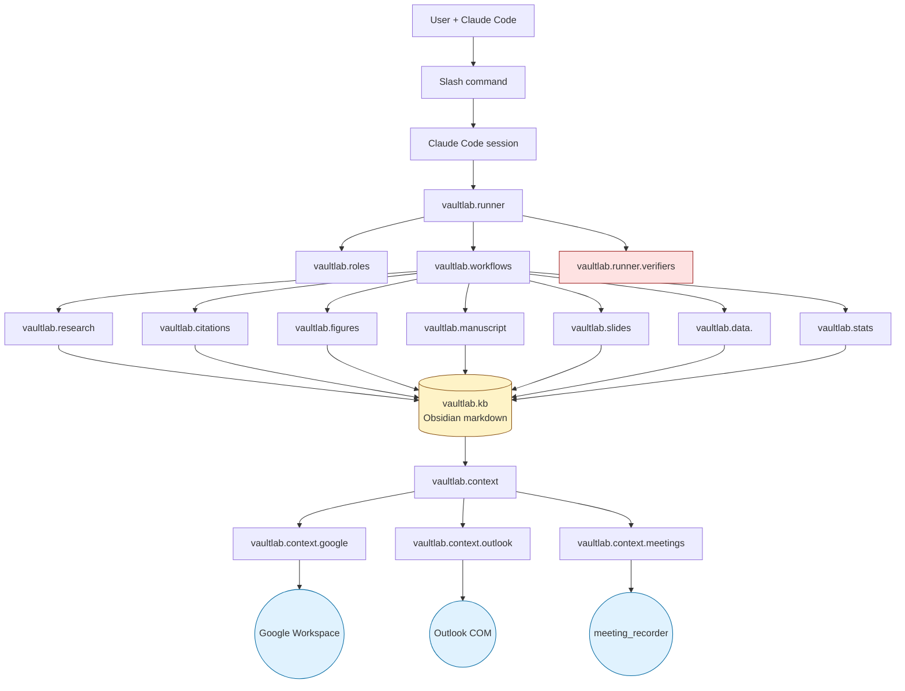

# vaultlab architecture

This is the public-facing architectural reference. For full design rationale and grilled decisions see `G:/My Drive/Knowledge/vaultlab/Sources/Notes/architecture-grill-2026-04-26/99-MASTER-PLAN-vaultlab-shared-design.md` (Bobby's private design archive). For invariants enforced in code reviews see [`AGENTS.md`](../AGENTS.md). For Claude Code session entry see [`CLAUDE.md`](../CLAUDE.md).

## What vaultlab is

A **Claude Code capability layer** for biological scientists. Not a competing harness — vaultlab is read by Claude Code as slash commands + skills + role prompts (all markdown), backed by a Python engine for the heavy work.

User invokes a slash command in Claude Code → Claude Code reads the relevant vaultlab markdown → vaultlab Python orchestrates → result lands in the KB → ready for next session.

## The four core commitments

These four commitments shape every architectural decision:

1. **Markdown is the user-facing interface; Python is the engine.** Slash commands, role prompts, recipe descriptions, layout templates, skill bundles — all live as `.md` files in the repo. Python contains: orchestration logic, data structures, runners, parsers, loaders. Python does NOT contain prompt content as embedded strings. This is what makes vaultlab Claude-Code-readable end-to-end.

2. **Anti-laziness on semantic reading.** Every LLM call requires quoted evidence. Surface-skim is the enemy. Multi-pass reading for complex tasks. Hedged voice always — *"consistent with X"* never *"is X."*

3. **Result-oriented agentic loop.** User describes a goal; vaultlab plans + verifies + refines internally; user sees the finished result. Bounded loop (max 3 iterations) with internal verifiers (citation, numeric, cross-doc, hedge enforcement).

4. **KB is the smartness.** Every analysis writes to KB; every analysis reads from KB. Cross-project reasoning emerges via retrieval over a growing markdown corpus. **No vector DBs**, no proprietary memory layers — just markdown that grows with your work.

## Top-level package layout

```
vaultlab/                        # The Python package
  __init__.py                    # Slim public barrel (~10 symbols)
  cli/                           # CLI entry — one .py + .md per subcommand

  # Orchestration core
  meetings.py                    # Meeting, Agenda, Mode, Role
  roles/<role>/                  # role.py + prompt.md per role
  runner/                        # ClaudeCodeRunner, build_meeting, reflection, verifiers
  workflows/                     # one .py + .md per workflow type
  patterns.py                    # EvidenceBundle, CascadeWatchdog
  provenance/                    # write .provenance.json + method.md
  parsers/                       # LLM output parsing
  status/                        # /research-status implementation
  config/                        # ProjectConfig, .vaultlab-project.json loading
  context/                       # RAG context assembly
  errors/                        # retry, degraded, llm_recover decorators
  prompts/                       # Prompt loader
  observability/                 # rich progress + JSONL trace
  cache/                         # Content-addressable caches

  # Capability subpackages
  research/                      # Literature: papers + sources + paperclip + smart_search
  citations/                     # NotebookLM-style citation verification
  kb/                            # KB + Obsidian setup + ingest + semantic search
  figures/                       # Construct from data: panel, collage, recipes, corpus
  slides/                        # Deck generation: layouts, themes, understand, annotate
  manuscript/                    # ManuscriptProject; markdown-persisted state
  data/                          # codex, maldi, scrnaseq, spatial, imaging, flow
  analysis/                      # result-analysis pipeline + stats.py (descriptive + verification-only)
  plan/                          # Pre-registration drafting
  evaluate/                      # Benchmarks: hallucinations, cluster_naming, captions

  # Companion-mode context pipes (NEW for companion mode)
  context/google/                # Google Workspace (cross-platform)
  context/outlook/               # Outlook Classic (Windows-only)
  context/meetings/              # Meeting recording + transcription (Windows-only)

.claude/                         # Ships with the repo
  commands/*.md                  # Slash commands
  skills/vaultlab/*.md           # Skill bundle (auto-loaded by Claude Code)

docs/                            # Browsable on GitHub; openable in Obsidian
examples/                        # End-to-end case studies (pbmc3k, visium, codex)
templates/                       # Contributor scaffolds
```

## Dependency graph



The KB sits at the center: every capability writes to it, every capability reads from it. Context pipes (Google, Outlook, meetings) feed the KB and the runner. Verifiers (red) gate every output before it reaches the user.

## Per-package architectural sketches

### `vaultlab.runner`
The orchestration heart. Implements the **result-oriented bounded loop** pattern: user task → plan → execute → verify → refine (max 3 iterations) → return result. Internal verifiers run citation audit, numeric audit, cross-doc consistency, self-critique, hedged-voice enforcement before any output is marked complete.

Key contract: callers don't see meeting-by-meeting state; they see goals + finished results. State lives on disk as ChainLink records in the KB so future sessions can resume.

### `vaultlab.roles`
14 specialized agent roles, each with `role.py` (thin Python loader) + `prompt.md` (the actual prompt content). Examples: `data_analyst`, `methods_critic`, `literature_surveyor`, `cluster_annotator`, `figure_lead`, `manuscript_drafter`, `coverage_auditor`. Each role's prompt enforces anti-laziness rules (REQUIRE quoted evidence) and hedged voice (NEVER assert; always *"consistent with"*).

### `vaultlab.research`
Literature search + paper retrieval + figure extraction. Wraps PubMed, Semantic Scholar, CrossRef, bioRxiv, Springer, Elsevier, plus paperclip MCP (8M-paper corpus). `MultiSource` aggregates; `smart_search` adds Claude-driven query expansion + dedup + re-rank. `extract.py` pulls figures from PDFs (NOT moved to `figures` — different lifecycle: extraction is research, generation is figures).

### `vaultlab.citations`
NotebookLM-style citation verification. Every `[N]` citation has an `EvidenceRecord` with rich passage_text + location + verdict + confidence + LLM judgment. Three-tier integrity: Tier 1 (DOI/PMID exists) → Tier 2 (semantic abstract match) → Tier 3 (exact quote + page). Hallucinated citations get verdict `HALLUCINATED`; verifier refuses to ship if any unresolved.

### `vaultlab.kb`
The growing brain. Plain markdown in an Obsidian-compatible folder. `ingest/` accepts URLs, PDFs, BibTeX, RIS, DOI, Zotero exports, plain markdown, folders. `semantic_search` indexes the KB for retrieval. `obsidian/` handles vault setup (Advanced URI, Dataview, Templater plugins). `start_here.py` maintains per-project `START_HERE.md` files automatically — every slash command that does meaningful work updates the file with activity + suggested-files-to-resume.

### `vaultlab.figures`
**Construct figures from your data** — NOT extract from papers (that's research). Three layers:
- `publication/` — low-level helpers (rcParams, figure-size presets, palettes with Rule 14 discipline, legend positioning, save_fig, parameter_stamp). Already implemented (P0.1 lift from CODEX_MALDIIMS).
- `recipes/` — high-level per-(data type, figure type) library. Each recipe MUST cite ≥3 published examples in `corpus/sources.json`. *No "Claude guessed it would look good" recipes.*
- `corpus/` — provenance for every recipe.

Plus layout density presets (PUBLICATION_TIGHT vs PRESENTATION_LOOSE).

### `vaultlab.slides`
Deck generation as the **flagship feature**. Four entry points: `from_manuscript()`, `from_kb_page()`, `from_finding()`, `from_paper(doi)`. Multi-stage figure understanding (`understand/` subpackage): detect panels → crop → describe via Claude Vision → identify elements (cells, receptors, plot elements) → suggest callouts. Layouts dispatch by content + intent (journal_club / thesis_committee / lab_meeting / conference_talk). Themes carry personality (default, duke, conference_clean, data_dense, storyteller).

### `vaultlab.manuscript`
`ManuscriptProject` tracks sections, figures, citations, status. Persists as **markdown** (manifest.md + sections/*.md + figures/<id>.{png,md} + evidence.json + drafts/v1/, v2/) — NOT JSON. Two render modes: draft (shows `^evidence` blocks for inline citation evidence) and final (strips evidence; ready for journal submission). `vaultlab manuscript bundle --target nature-metabolism` produces journal-ready DOCX + 300dpi TIFFs + BibTeX + cover letter.

### `vaultlab.data.<modality>`
Modality-specific wrappers (NOT reimplementations). `codex` for multiplex IF (Cellpose/StarDist/Mesmer for segmentation, panel-aware clustering, niche detection). `maldi` for MALDI-IMS (pyimzML + Cardinal-via-rpy2, ion images, multi-modal coregistration). `scrnaseq` for single-cell (scanpy + anndata canonical pipeline). `spatial` for Visium/Xenium (squidpy). `imaging`, `flow` for completeness. Wraps mature Python tools; adds vaultlab-specific glue (provenance, KB note auto-write, hedged LLM interpretation).

### `vaultlab.context`
The **research-companion** layer. Three pipes that pull life context into Claude Code:
- `google/` — Workspace OAuth (Docs / Sheets / Drive / Gmail / Calendar). Cross-platform.
- `outlook/` — Outlook Classic via COM. Windows-only.
- `meetings/` — meeting recorder integration. Windows-only (MIT contribution opportunity for macOS/Linux backend).

Without these, vaultlab is generic LLM chat. With them, vaultlab is a colleague who reads everything you've written.

### `vaultlab.evaluate`
Benchmarks (per file 16): citation hallucination rate, cluster naming accuracy (HuBMAP tonsil), figure caption faithfulness. LLM-as-judge with anti-laziness rules + KB grounding. `vaultlab evaluate --no-llm` runs the cheap deterministic checks; `--with-llm` adds expensive LLM-judge passes.

## State machine: project lifecycle

```
1. Onboard: /onboard-project <path>
   → vaultlab scans the folder structure
   → Reads top-level docs
   → Builds a draft project understanding via Claude
   → Asks grill-me-style questions for verification
   → Writes <kb>/Wiki/Projects/<slug>.md (canonical understanding)
   → Initializes <kb>/Wiki/Projects/<slug>/START_HERE.md
   → Suggests .vaultlab-project.json

2. Daily work: /research-pipeline, /lit-search, /figure-gen, /research-write, ...
   → Each command writes to KB + updates START_HERE.md
   → Provenance receipts for every output
   → Hedged voice + verified citations enforced

3. Resume: opening project in Claude Code
   → Claude Code reads <kb>/Wiki/Projects/<slug>/START_HERE.md
   → Sees current focus + recent activity + files to read first
   → User picks up where they left off in seconds

4. Submit: /manuscript-export final
   → Strips evidence blocks
   → Bundles to journal-ready format
   → Final review packet for PI
```

## Forward-compatibility commitments (per file 21)

vaultlab v0.1+ promises:

1. `.vaultlab-project.json` schema is **additive only**
2. Per-run `manifest.json` schema is **additive only**
3. KB folder layout is **additive only**
4. Slash command names are **stable** (deprecation warnings before removal)
5. Role identifiers are **stable** (prompts can change; identifiers cannot)
6. Output folder naming (`runs/<run-id>/`) is **stable**

These commitments make it safe to use vaultlab on real projects today without fear of v0.2 breakage.

## See also

- [`AGENTS.md`](../AGENTS.md) — invariants enforced in code reviews
- [`CLAUDE.md`](../CLAUDE.md) — Claude Code session entry point
- [`INSPIRATIONS.md`](../INSPIRATIONS.md) — what we drew from where
- [`docs/design-rationale.md`](design-rationale.md) — design choices novel to vaultlab vs synthesis vs borrowed
- [`docs/long-term-reproducibility.md`](long-term-reproducibility.md) — model-versioning philosophy
- [`docs/comparison.md`](comparison.md) — vs PaperQA / scanpy / FutureHouse / scverse / Aider (TODO populate)
