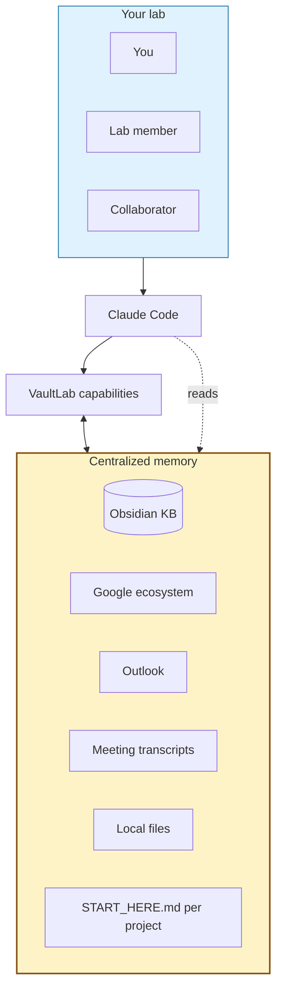

# How it works (diagram, parked)

This is the system-overview diagram pulled out of the main README on
2026-04-30. Saved here so it can be re-introduced later (probably with a
cleaner version) when the visual quality is up to launch standard.

You (or anyone you've shared the KB with) talks to Claude Code. Claude
Code reads VaultLab + memory. VaultLab orchestrates work, writes results
back into the memory. Memory is plain markdown on Google Drive — share
it like any folder, scale across your lab without infrastructure.
