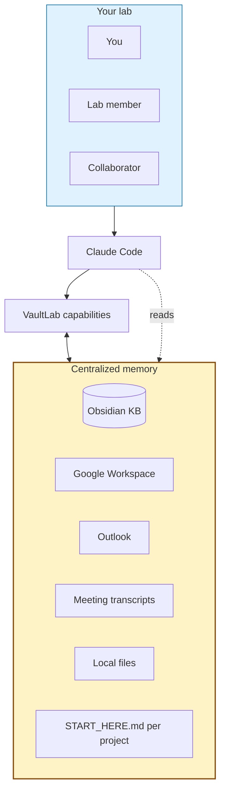

# What VaultLab does

VaultLab is an AI research companion for biological scientists. It pulls every source of context about your work into one place the LLM reads, then orchestrates literature, data, figures, manuscripts, and slide work on top of that memory.

This page covers the surface area at a glance. For end-to-end workflows, see [`use-cases.md`](use-cases.md).

---

## The flagship — centralized memory for your whole research life

VaultLab pulls every source of context about your work into one place the LLM reads:

| | |
|---|---|
| 📓 **Knowledge base** | Plain-markdown KB (Obsidian-native). Papers, notes, findings, manuscripts, figures — all here. |
| 🎤 **Meeting transcripts** | Record + auto-transcribe (local Whisper or cloud). *"What did we decide about cluster 7 last Tuesday?"* — answered from the transcript. |
| 📥 **Inbox + calendar + work log** | Outlook (Windows) or Gmail + Google Docs lab log + Calendar. *"Brief me on this morning"* works without you setting context. |
| 🚀 **Auto-resumed projects** | Every project has a `START_HERE.md` VaultLab maintains. Read one file, you're caught up in 30 seconds. |

Onboard a lab member by sharing the Drive folder. Cross-project insights surface automatically: *"You saw a similar exhausted-T-cell phenotype in your 2026-03 tonsil run."*

---

## What VaultLab does on top of that memory

### 📊 Drafts entire figures from your data

Not just "wraps matplotlib." VaultLab has a curated **recipe library** — every recipe cites ≥3 published examples. Tell it *"make a marker dot-plot for these clusters"* and you get a publication-tight figure with auto-generated caption, drawn from a pattern that's been used in real Cell / Nature papers. No invented visualizations.

### 📄 NotebookLM-style citations

Drafts methods sections with `[N]` markers, then verifies every one **semantically** against the actual source paper. Hover over a citation in your draft — see the exact passage that supports it. Hallucinated citations get flagged automatically; VaultLab refuses to ship if any unresolved.

### 🎤 Paper → journal-club deck in 90 seconds

`/paper-to-slides 10.1038/...` extracts figures from a PDF, composes a 12-slide deck with auto-generated speaker notes, exports `.pptx`. The flagship demo. *No other tool does this.*

### 🧬 Wraps the analysis tools you trust

scanpy, squidpy, scikit-image, Cellpose, scipy.stats, statsmodels, pingouin — VaultLab has a curated index so the LLM picks **real functions from real packages**, not raw web searches that hallucinate function names.

> **VaultLab is a companion you customize, build upon, and direct.** Take the agent as far as you want — quick assist or full lab-wide deep-dive. *Other tools force a single mode; VaultLab adapts to the depth your work needs.*

---

## How it works

You (or anyone you've shared the KB with) talks to Claude Code. Claude Code reads VaultLab + memory. VaultLab orchestrates work, writes results back into the memory. Memory is **plain markdown** on Google Drive — share it like any folder, scale across your lab without infrastructure.

---

## Specialized modules per modality

VaultLab has modules tuned to specific modalities for spatial-omics-heavy research:

- **CODEX multiplex IF** — segmentation (Mesmer/Cellpose/StarDist), marker normalization, cellular neighborhood detection (Schürch 2020 + lab CN methodology)
- **MALDI imaging** — pyimzML + Cardinal-via-rpy2 wrappers, ion-image visualization, multi-modal coregistration with H&E
- **Spatial transcriptomics** — Visium / Xenium / SpatialData via squidpy
- **Single-cell RNA-seq** — scanpy + anndata canonical pipelines
- **Generic imaging / flow cytometry** — wrappers for standard tools

These are not required to use VaultLab; they're there if your work touches them. Generic AI tools wrap whatever's on PyPI — VaultLab's modality modules carry the methods working researchers actually use, not the generic defaults.

---

## Architecture philosophy

1. **Markdown is the user-facing interface; Python is the engine.** Slash commands, role prompts, recipes are markdown — Claude Code reads them directly.
2. **Anti-laziness on semantic reading.** Every LLM call requires quoted evidence. No surface-skim.
3. **Result-oriented agentic loop.** You describe a goal; VaultLab plans + verifies + refines internally; you see the finished result.
4. **KB is the smartness.** No vector DBs, no hidden state. Markdown grows with your work; cross-project reasoning emerges via retrieval.

Full spec: [`architecture.md`](architecture.md). Invariants for contributors: [`../AGENTS.md`](../AGENTS.md).
